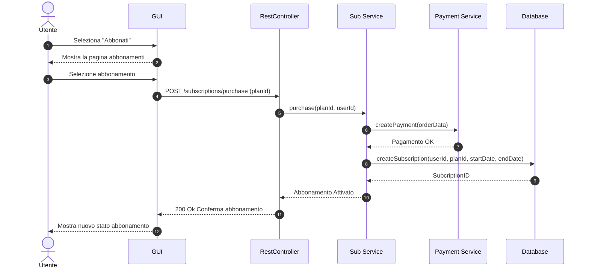

```mermaid
sequenceDiagram
    autonumber
    actor Utente
    participant GUI as GUI
    participant API as RestController
    participant SubscriptionService as Sub Service
    participant PaymentService as Payment Service
    participant DB as Database

    Utente ->> GUI: Seleziona "Abbonati"
    GUI -->> Utente: Mostra la pagina abbonamenti
    Utente ->> GUI: Selezione abbonamento
    GUI ->> API: POST /subscriptions/purchase (planId)
    API ->> SubscriptionService: purchase(planId, userId)
    
    SubscriptionService ->> PaymentService: createPayment(orderData)
    PaymentService -->> SubscriptionService: Pagamento OK
    
    SubscriptionService ->> DB: createSubscription(userId, planId, startDate, endDate)
    DB -->> SubscriptionService: SubcriptionID
    
    SubscriptionService -->> API: Abbonamento Attivato
    API -->> GUI: 200 Ok Conferma abbonamento
    GUI -->> Utente: Mostra nuovo stato abbonamento
```