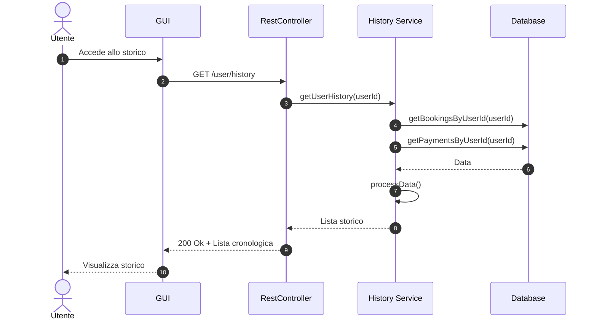

```mermaid
sequenceDiagram
    autonumber
    actor Utente
    participant GUI as GUI
    participant API as RestController
    participant HistoryService as History Service
    participant DB as Database

    Utente ->> GUI: Accede allo storico
    GUI ->> API: GET /user/history
    API ->> HistoryService: getUserHistory(userId)
    HistoryService ->> DB: getBookingsByUserId(userId)
    HistoryService ->> DB: getPaymentsByUserId(userId)
    DB -->> HistoryService: Data
    HistoryService ->> HistoryService: processData()
    HistoryService -->> API: Lista storico
    API -->> GUI: 200 Ok + Lista cronologica
    GUI -->> Utente: Visualizza storico
```