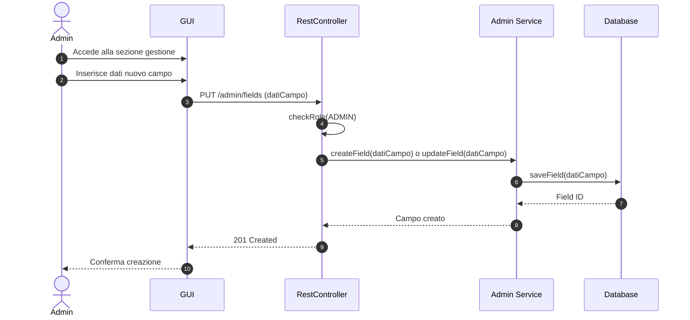

```mermaid
sequenceDiagram
    autonumber
    actor Admin
    participant GUI as GUI
    participant API as RestController
    participant AdminService as Admin Service
    participant DB as Database

    Admin ->> GUI: Accede alla sezione gestione
    Admin ->> GUI: Inserisce dati nuovo campo
    GUI ->> API: PUT /admin/fields (datiCampo)
    API ->> API: checkRole(ADMIN)
    API ->> AdminService: createField(datiCampo) o updateField(datiCampo)
    AdminService ->> DB: saveField(datiCampo)
    DB -->> AdminService: Field ID
    AdminService -->> API: Campo creato
    API -->> GUI: 201 Created
    GUI -->> Admin: Conferma creazione
```