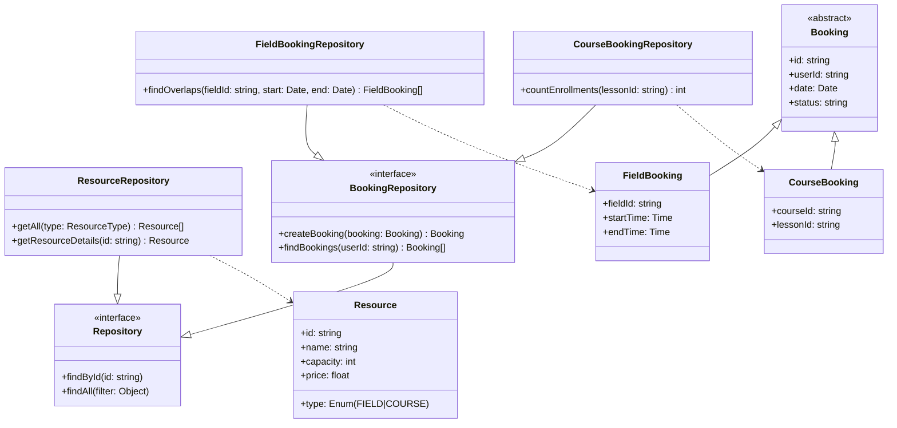
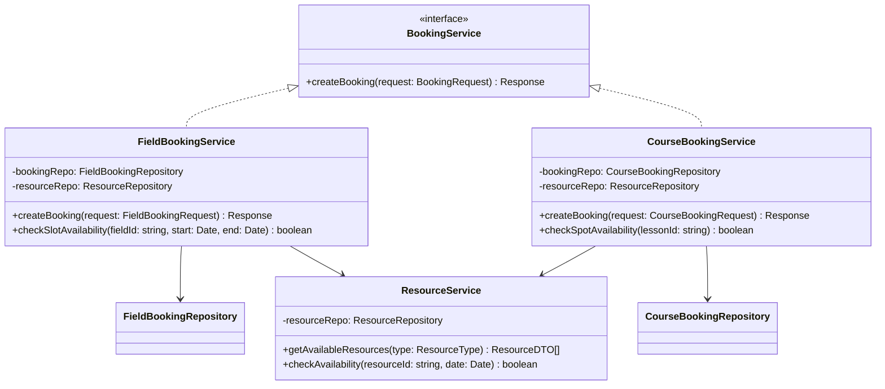
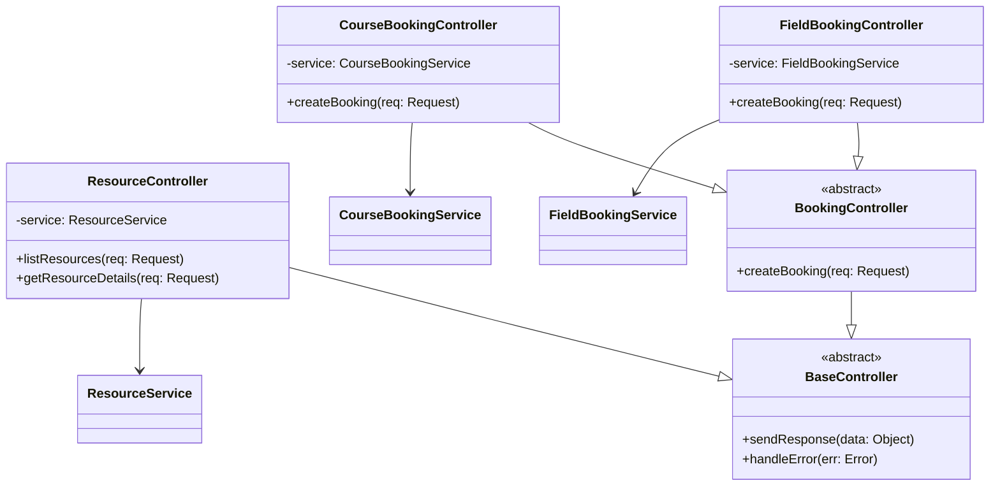
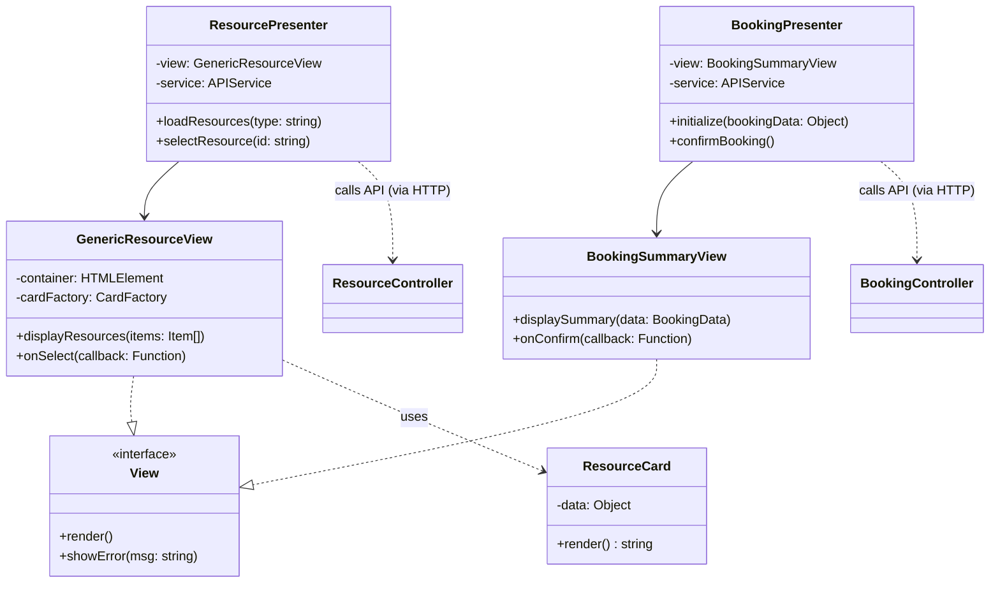

 # Classi Comuni UC03, UC04, UC05, UC06

Diagramma delle classi ottimizzato per massimizzare la riutilizzabilità e limitare il numero di classi, coprendo la visualizzazione e prenotazione di Campi (UC03-UC04) e Corsi (UC05-UC06).

### Backend - Repository Layer

Si utilizza un approccio dove le risorse (Campi/Corsi) possono essere gestite genericamente, ma le prenotazioni sono divise per gestire le specificità (es. slot temporali per campi vs posti limitati per corsi).

### Backend - Service Layer

I servizi sono divisi per gestire la logica specifica di prenotazione.

### Backend - Controller Layer

Controller specifici per gestire le diverse logiche di prenotazione.

### Frontend - View e Presenter

Frontend ottimizzato con componenti riutilizzabili (`ResourceCard`) e Presenter base. Si sfrutta l'ereditarietà o la configurazione per adattare la vista a Campi o Corsi.

