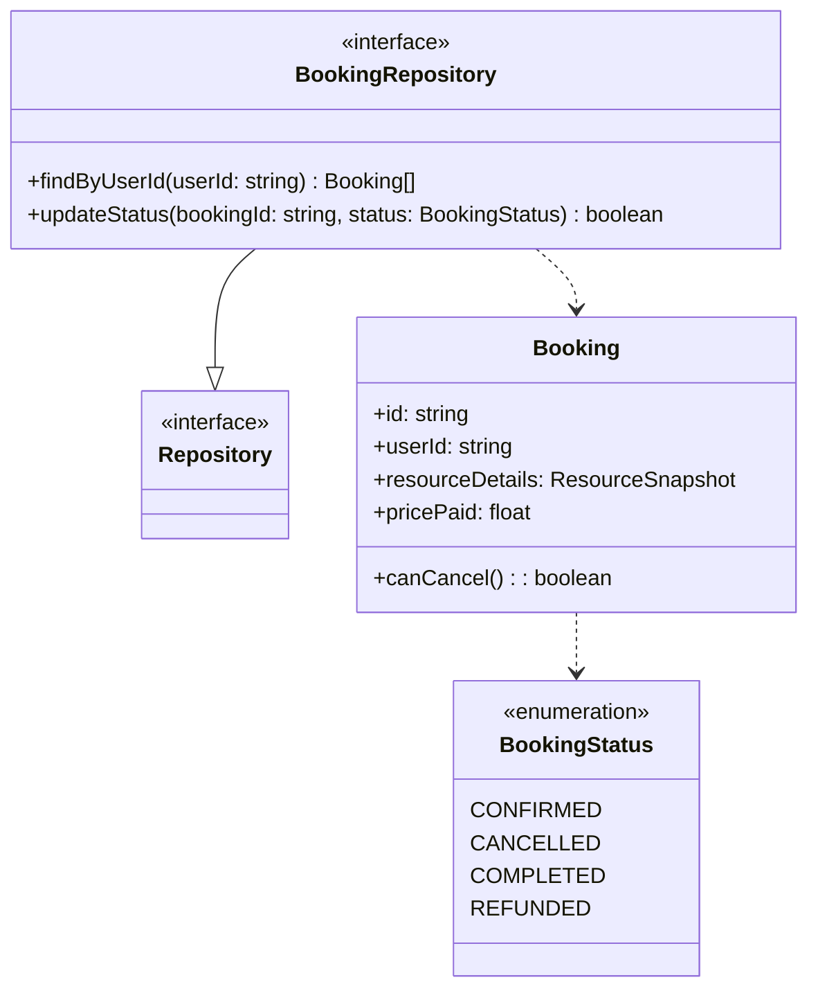
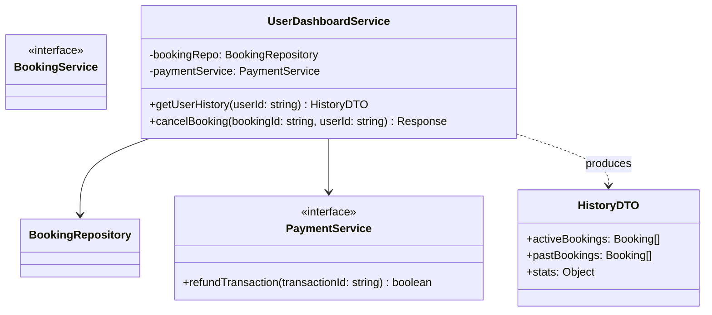
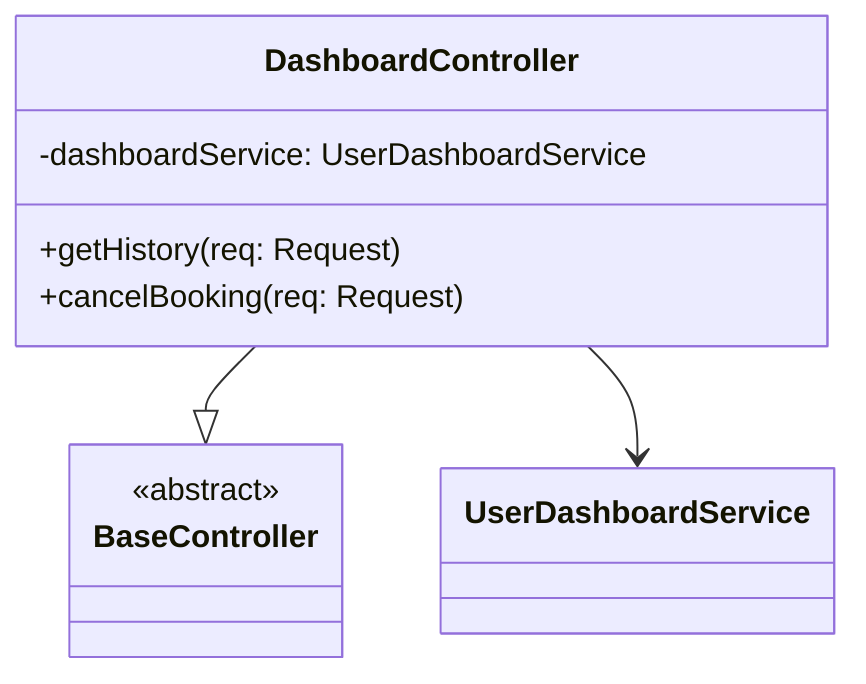
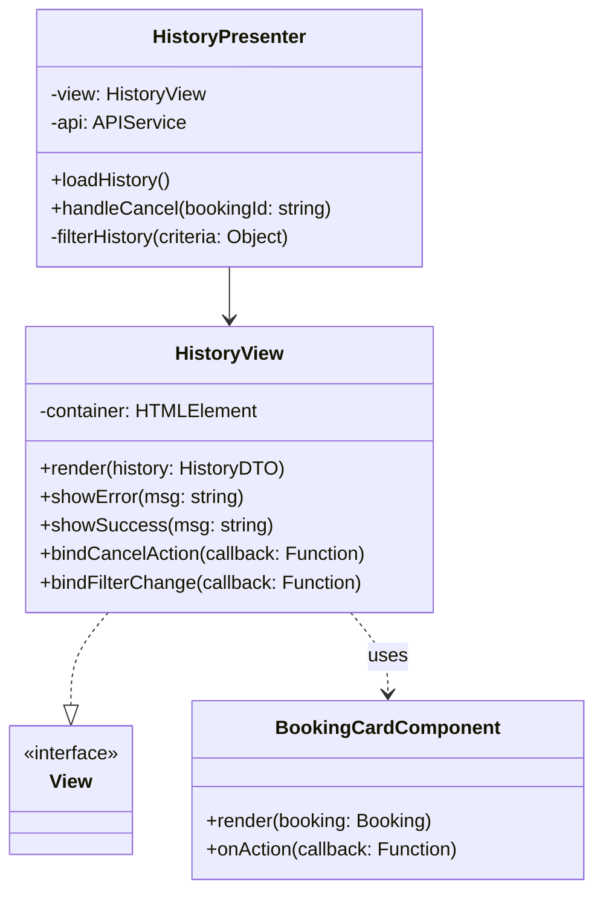

# Classi UC07, UC10 - Modulo Gestione Utente e Storico

Questo modulo gestisce l'interazione dell'utente con le proprie attività passate e future, permettendo la visualizzazione dello storico (UC10) e la gestione delle prenotazioni attive come la cancellazione (UC07).

## Backend - Repository Layer

Si estende il `BookingRepository` (già definito in UC03/06) per includere le query specifiche per utente e gli aggiornamenti di stato.

## Backend - Service Layer

Il `UserDashboardService` centralizza la logica per il cruscotto utente.

## Backend - Controller Layer

## Frontend - View e Presenter

Si utilizza un pattern **MVP** dove il Presenter recupera i dati storici e gestisce le azioni utente (es. click su "Cancella").

---

### UC10 - Caricamento Storico

