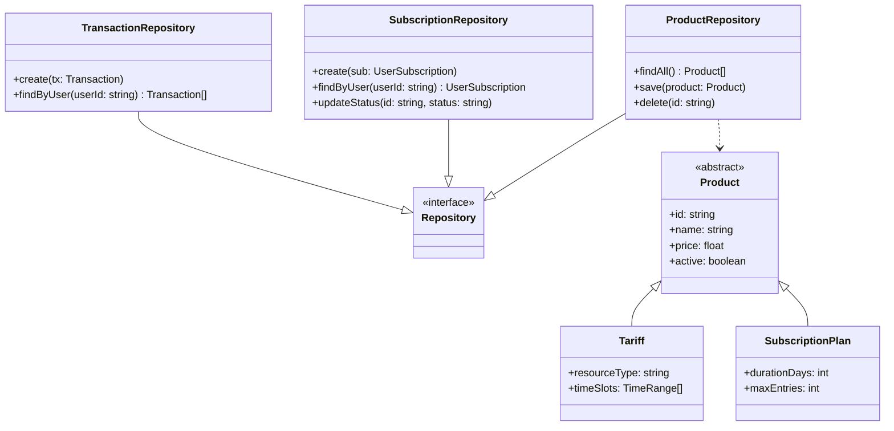
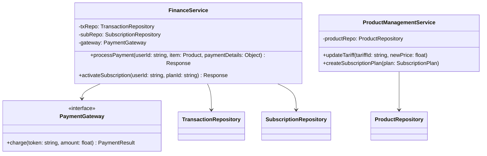
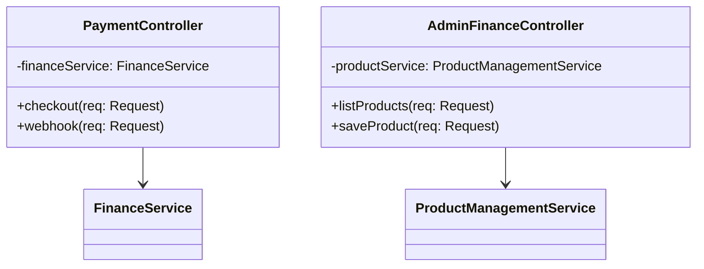
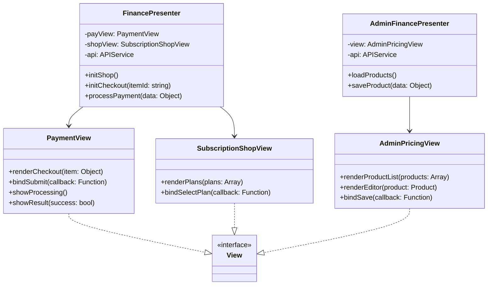
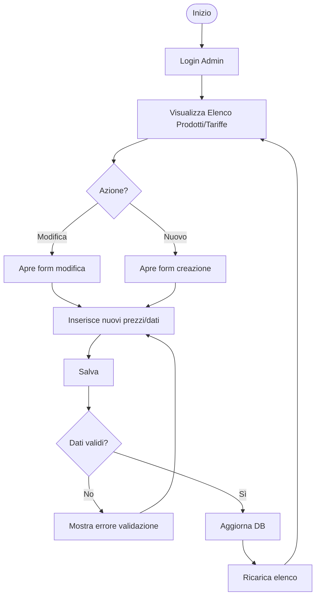
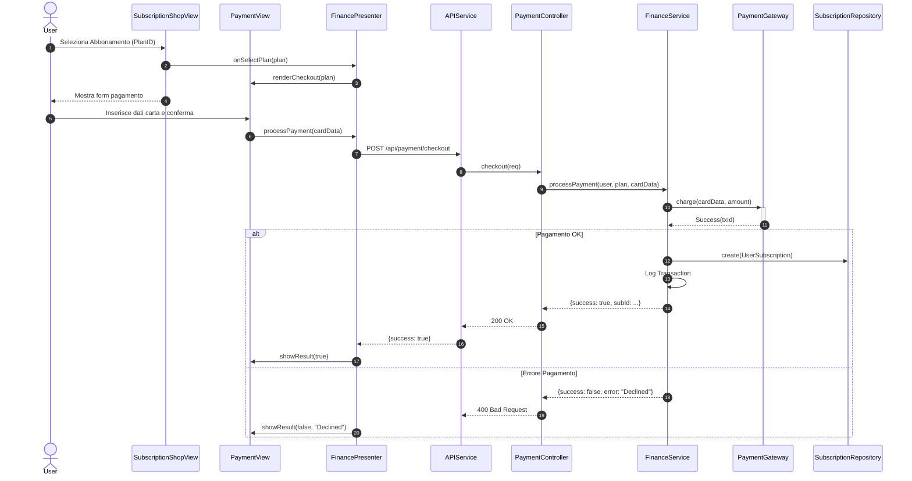
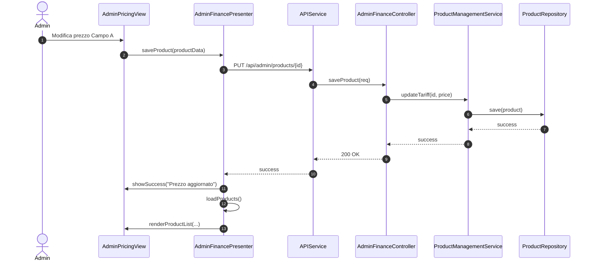

# Classi UC08, UC09, UC13 - Modulo Finance (Pagamenti e Abbonamenti)

Questo modulo raggruppa le funzioni legate agli aspetti economici: pagamenti singoli (UC08), gestione e acquisto abbonamenti (UC09) e definizione delle politiche di prezzo/tariffari (UC13).

## Backend - Repository Layer

Gestione delle transazioni, delle definizioni dei prodotti (abbonamenti/tariffe) e delle sottoscrizioni utente.

## Backend - Service Layer

Il `FinanceService` gestisce i pagamenti e il `ProductManagementService` permette all'admin di configurare i prezzi.

## Backend - Controller Layer

## Frontend - View e Presenter

Gestione del flow di pagamento e pannello admin.

---

### UC13 - Gestione Tariffe (Admin)

---

## Diagrammi di Sequenza

### UC09 - Acquisto Abbonamento

### UC13 - Aggiornamento Tariffa (Admin)

