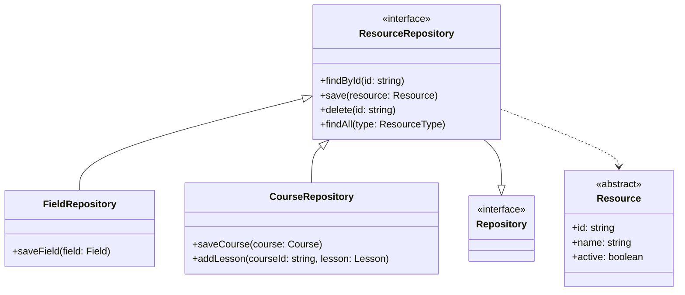
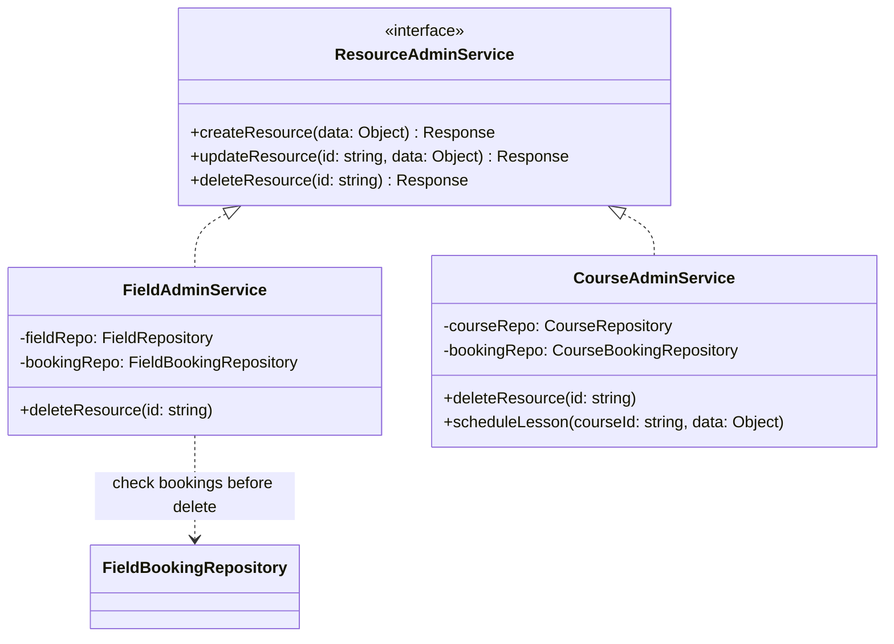
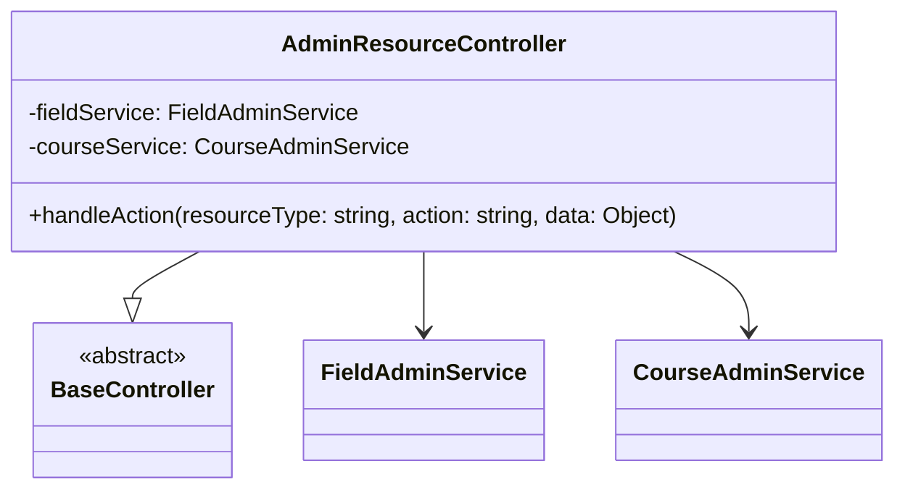
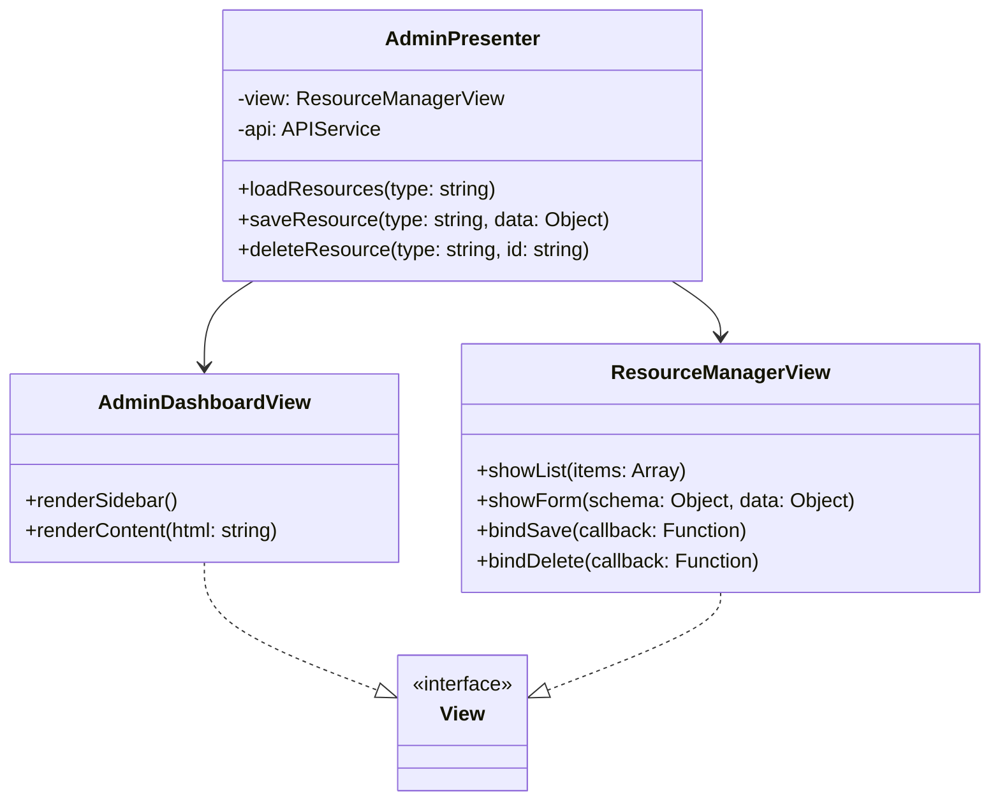
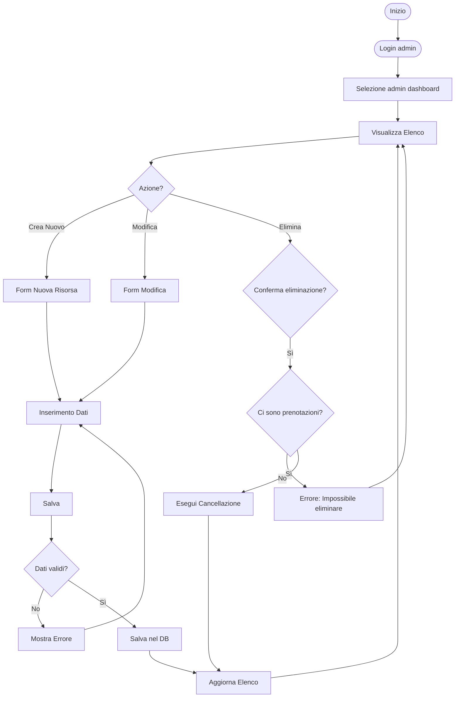
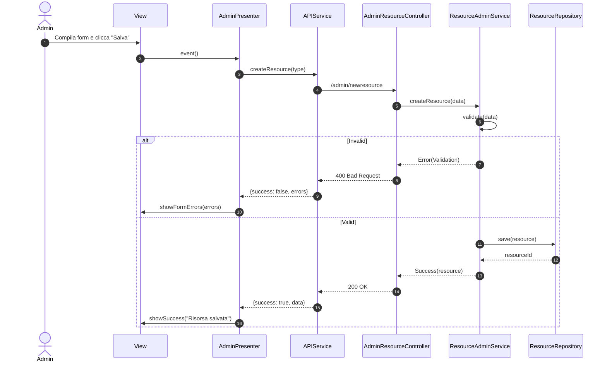

# Classi UC11, UC12 - Modulo Amministrazione Risorse

Questo modulo gestisce le operazioni di backoffice per l'amministratore, specificamente la creazione, modifica e cancellazione di Campi sportivi (UC11) e Corsi/Lezioni (UC12).

## Backend - Repository Layer

Il `ResourceRepository` (visto in UC03/UC06) viene qui utilizzato nella sua interezza, includendo i metodi di scrittura riservati all'admin.

## Backend - Service Layer

Services dedicati alla gestione del ciclo di vita delle risorse, inclusi controlli di integrità (es. non cancellare campi con prenotazioni future).

## Backend - Controller Layer

## Frontend - View e Presenter

L'interfaccia di amministrazione richiede tabelle dati (DataGrid) e form complessi per l'editing.

---

## Diagrammi di Attività

### UC11, UC12 - Gestione Risorse (CRUD)

---

## Diagrammi di Sequenza

### UC11, UC12 - Salvataggio Risorsa (Create/Update)

