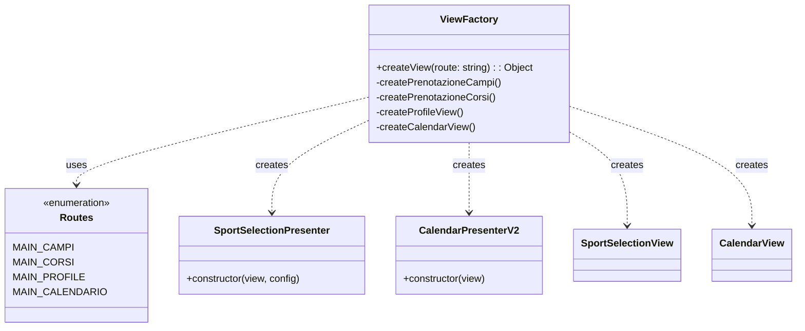
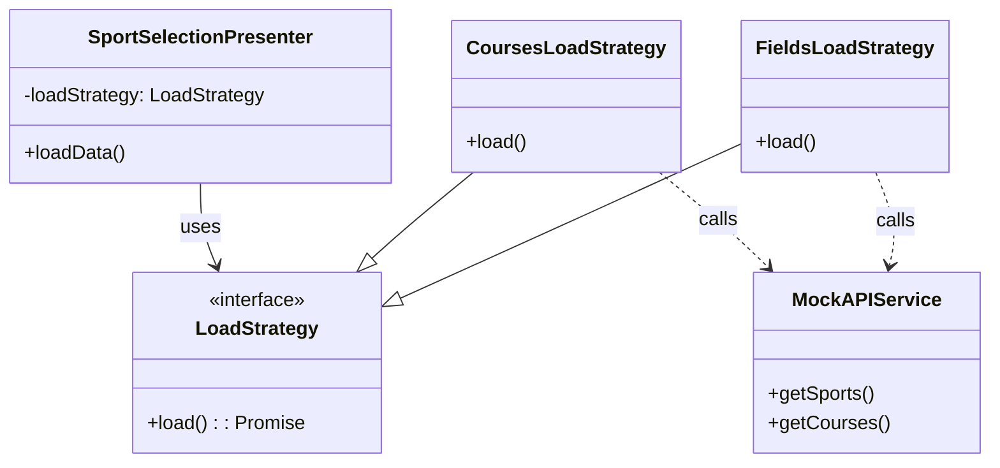
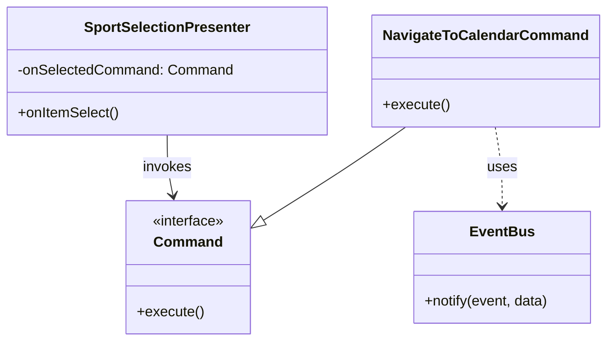

# Design Patterns Frontend

Questo documento descrive i principali design pattern introdotti nel refactoring del frontend per migliorare la modularità, la manutenibilità e la gestione delle dipendenze.

## 1. Factory Pattern

Il **Factory Pattern** è stato introdotto per centralizzare la logica di creazione delle View e dei Presenter. Questo permette di disaccoppiare il router dalla logica di istanziazione dei componenti e facilita l'iniezione delle dipendenze (come le strategie o i comandi).

### Implementazione

- **`ViewFactory`**: Classe statica che funge da factory unica per l'applicazione. In base alla rotta richiesta, istanzia e configura la coppia View-Presenter appropriata.

### Diagramma delle Classi

## 2. Strategy Pattern

Lo **Strategy Pattern** è utilizzato per incapsulare le diverse logiche di caricamento dei dati (es. caricare i Campi vs caricare i Corsi). Questo permette di riutilizzare lo stesso `SportSelectionPresenter` per casi d'uso diversi (UC03 Prenotazione Campi e UC05/06 Prenotazione Corsi), cambiando solo la strategia iniettata.

### Implementazione

- **`LoadStrategy`**: Interfaccia (o classe base) che definisce il contratto `load()`.
- **`FieldsLoadStrategy`**: Implementazione concreta che recupera la lista degli sport/campi chiamando `apiService.getSports()`.
- **`CoursesLoadStrategy`**: Implementazione concreta che recupera la lista dei corsi chiamando `apiService.getCourses()`.
- **`SportSelectionPresenter`**: Il Context che riceve una `LoadStrategy` nel costruttore e la utilizza per recuperare i dati, senza conoscere i dettagli dell'implementazione.

### Diagramma delle Classi

## 3. Command Pattern

Il **Command Pattern** è stato adottato per disaccoppiare l'invocante (il Presenter o la View) dall'azione effettiva da eseguire (es. navigazione). In questo modo, il `SportSelectionPresenter` non deve sapere *dove* navigare dopo una selezione, ma deve solo eseguire il comando configurato.

### Implementazione

- **`Command`**: Interfaccia che definisce il metodo `execute()`.
- **`NavigateToCalendarCommand`**: Comando concreto che pubblica un evento sul bus per navigare alla vista del calendario.
- **`SportSelectionPresenter`**: Riceve un comando (`onSelectedCommand`) nella configurazione e lo esegue quando un elemento viene selezionato.

### Diagramma delle Classi

