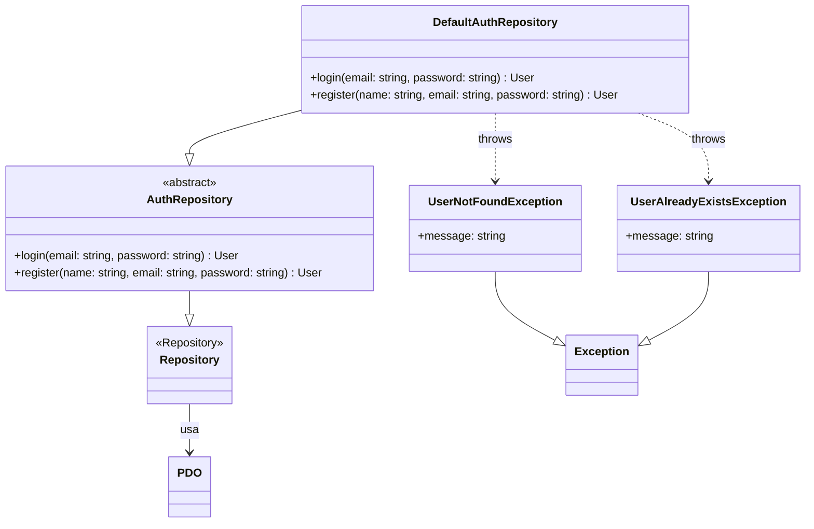
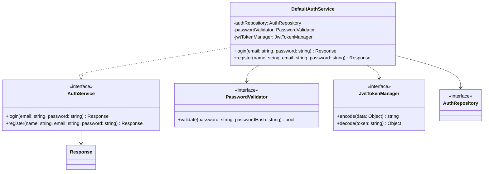
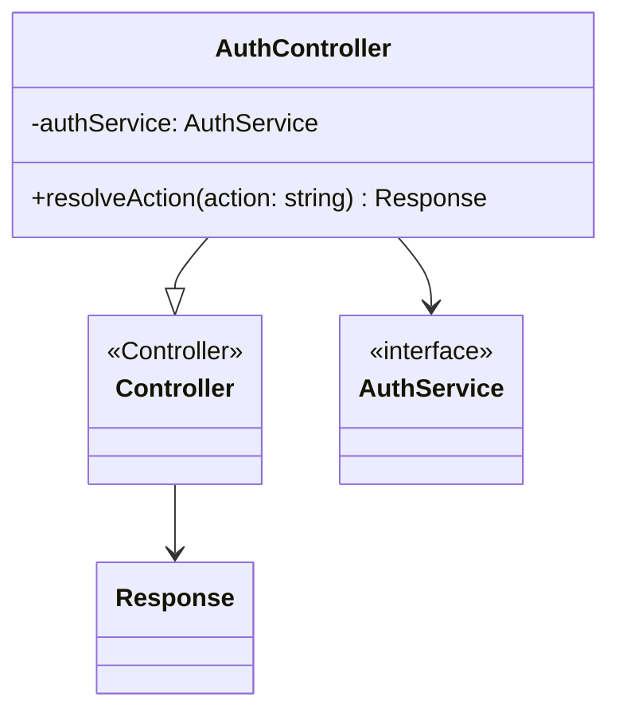
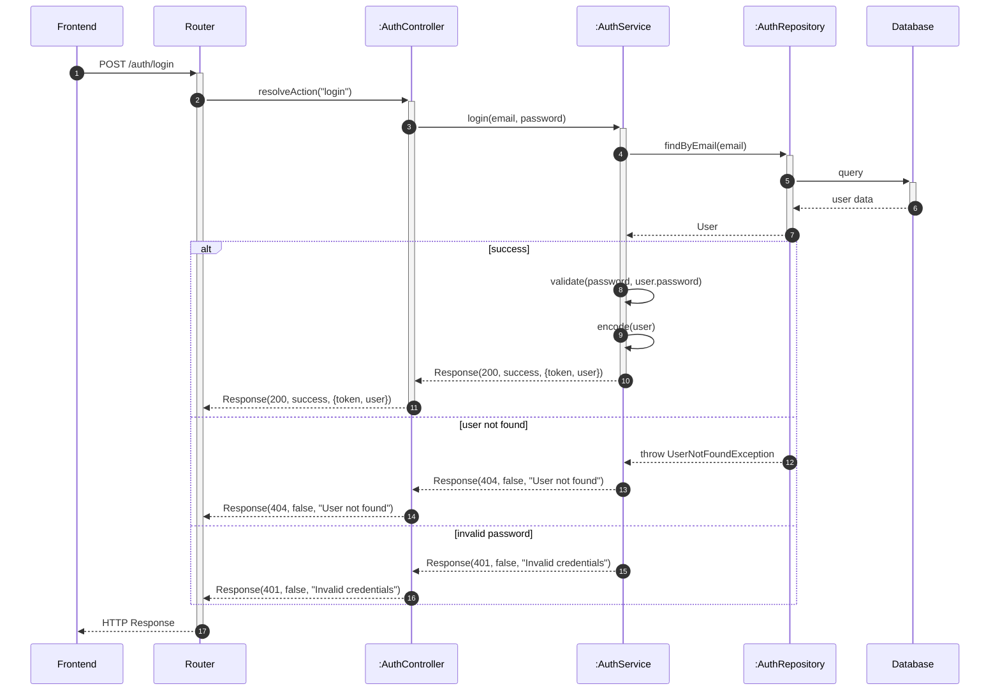
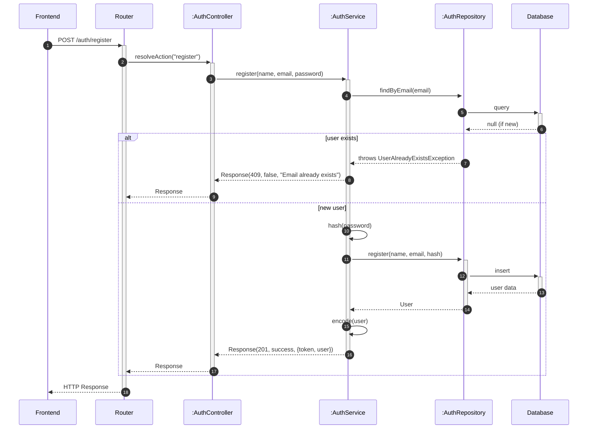

# Modulo Auth - Backend

## Casi d'uso Correlati
- **UC01**: Registrazione / Autenticazione
- **UC02**: Visualizzare e Gestire Profilo Utente

Questo modulo gestisce la logica server per l'autenticazione, la validazione delle credenziali e la gestione delle sessioni (JWT).

## Diagramma delle Classi

### Repository Layer

### Service Layer

### Controller Layer

## Diagrammi di Sequenza

### Flusso Login (Backend)

### Flusso Registrazione (Backend)

