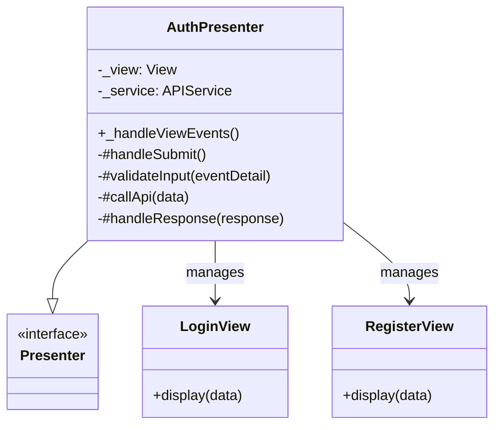
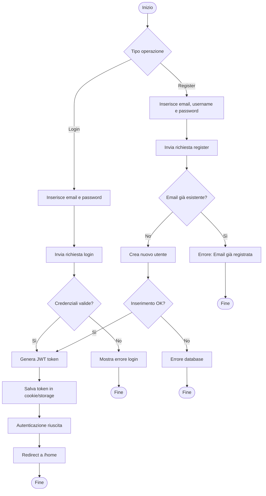
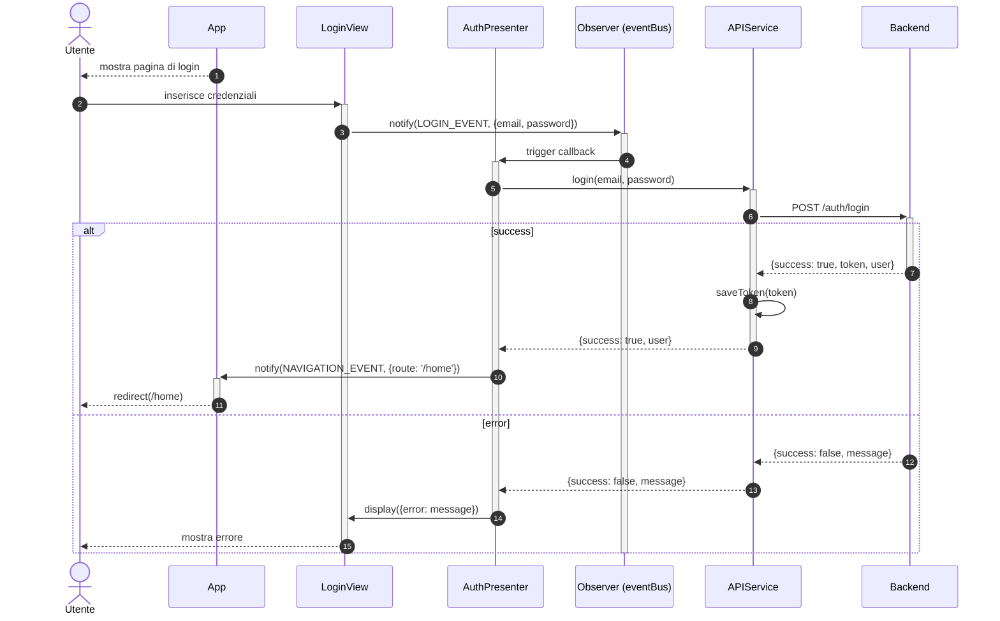
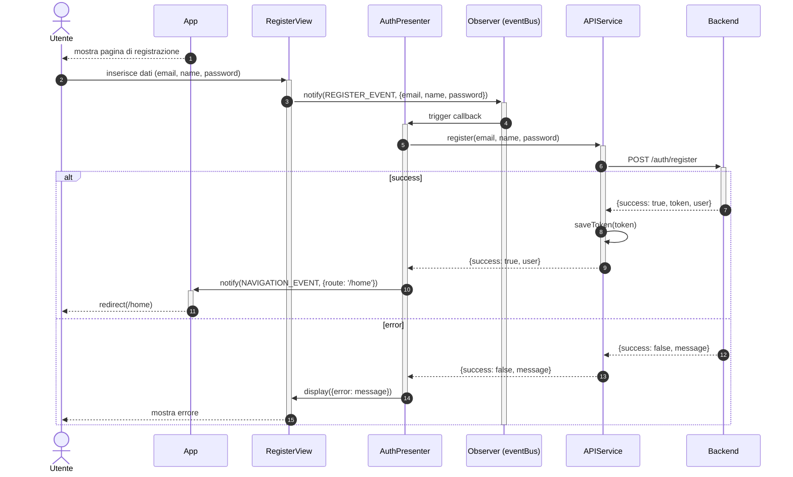

# Modulo Auth - Frontend

## Casi d'uso Correlati
- **UC01**: Registrazione / Autenticazione
- **UC02**: Visualizzare e Gestire Profilo Utente

Questo modulo gestisce l'autenticazione dell'utente (Login e Registrazione).

## Componenti

### AuthPresenter
Gestisce la logica di business per l'autenticazione.
- Sottoscrive all'evento `AUTH_SUBMIT_EVENT`.
- Valida i dati di input (email, password, e conferma password per la registrazione).
- Chiama il servizio di autenticazione (`login` o `register`).
- Gestisce la risposta e naviga alla rotta principale in caso di successo.

### LoginView / RegisterView
Le viste responsabili per la UI di login e registrazione.
- Emettono l'evento `AUTH_SUBMIT_EVENT` con i dati inseriti dall'utente.
- Visualizzano errori o messaggi di successo.

## Diagramma delle Classi

## Diagramma di Attività

## Diagrammi di Sequenza

### Flusso Login (Frontend)

### Flusso Registrazione (Frontend)

