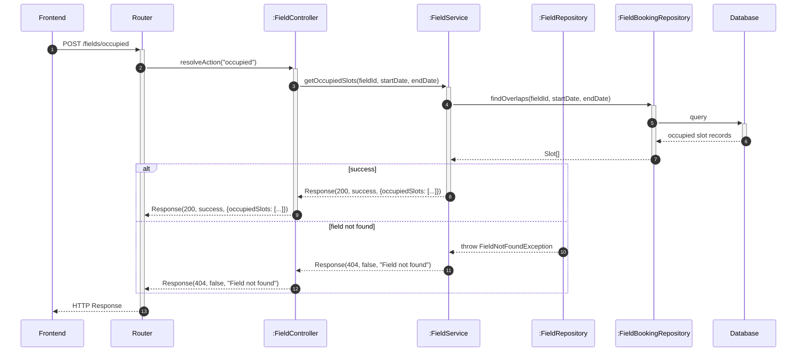
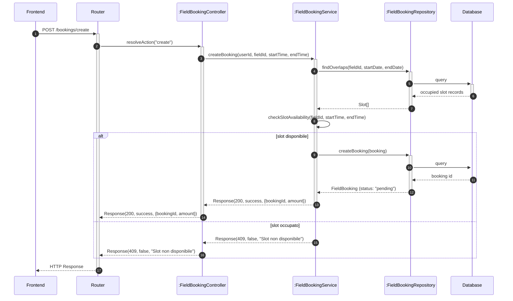
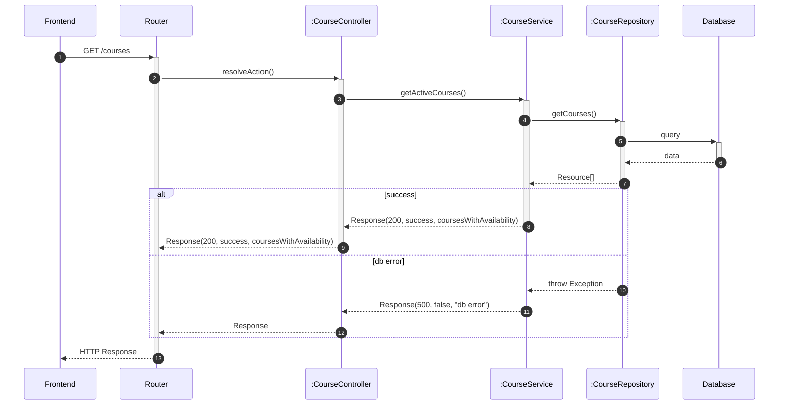
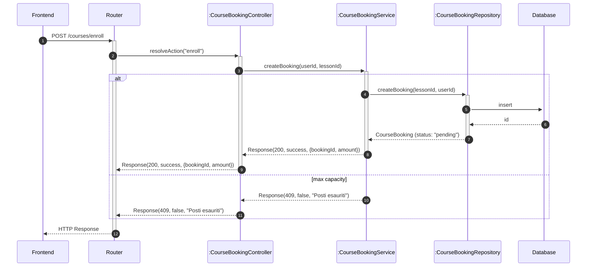

# Modulo Calendario - Backend

## Casi d'uso Correlati
- **UC03**: Visualizzazione Disponibilità Campi
- **UC04**: Prenotazione Campo Sportivo
- **UC05**: Visualizzazione Corsi
- **UC06**: Iscrizione a una Lezione

Questo modulo gestisce la logica per la disponibilità di campi e corsi e la gestione delle prenotazioni lato server.

## Diagrammi di Sequenza

### Flusso Recupero Disponibilità (Backend - UC03)

### Flusso Creazione Prenotazione (Backend - UC04)

### Flusso Visualizzazione Corsi (Backend - UC05)

### Flusso Iscrizione Lezione (Backend - UC06)

