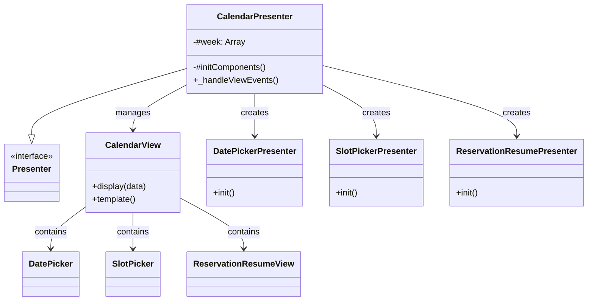
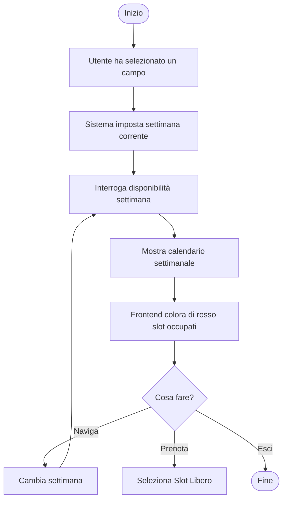
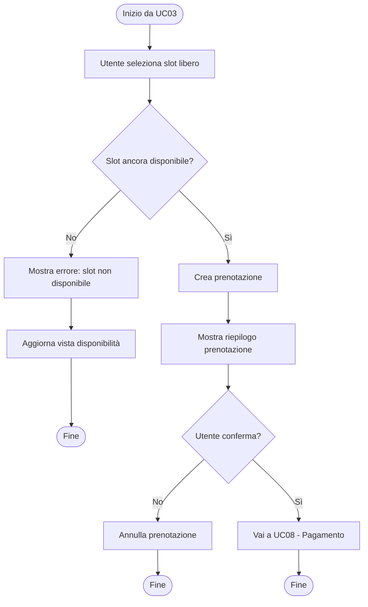
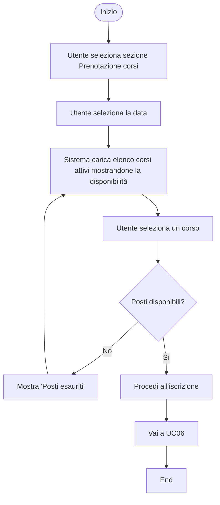
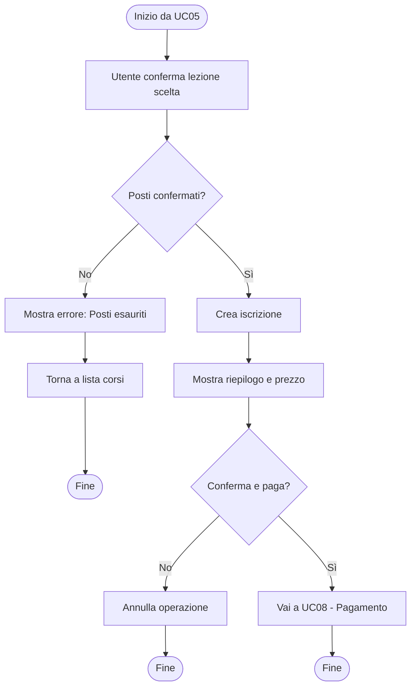
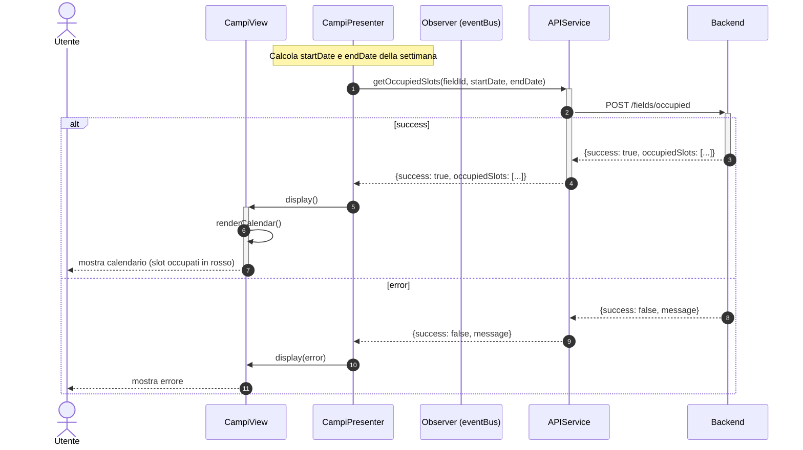
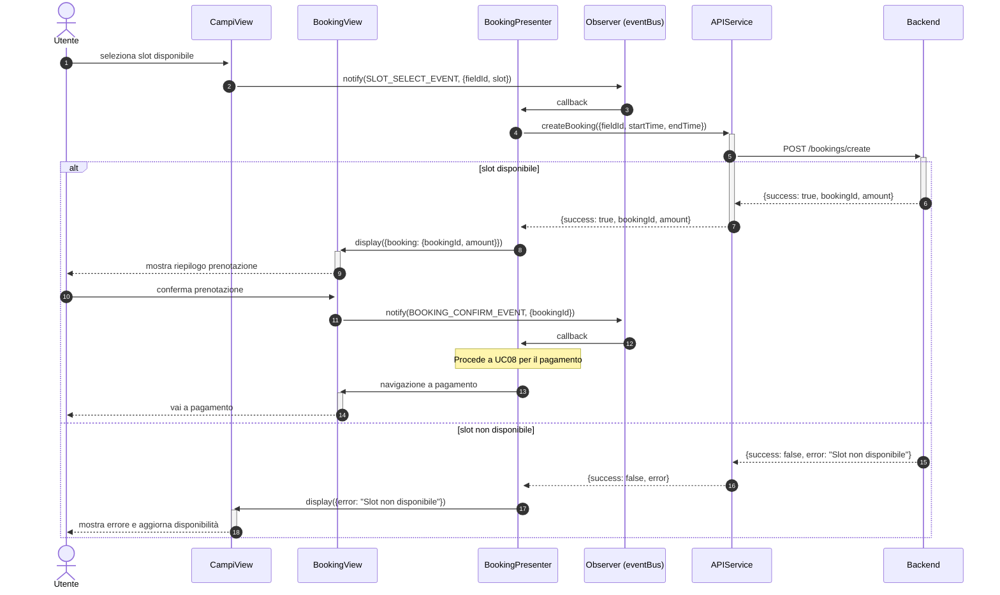
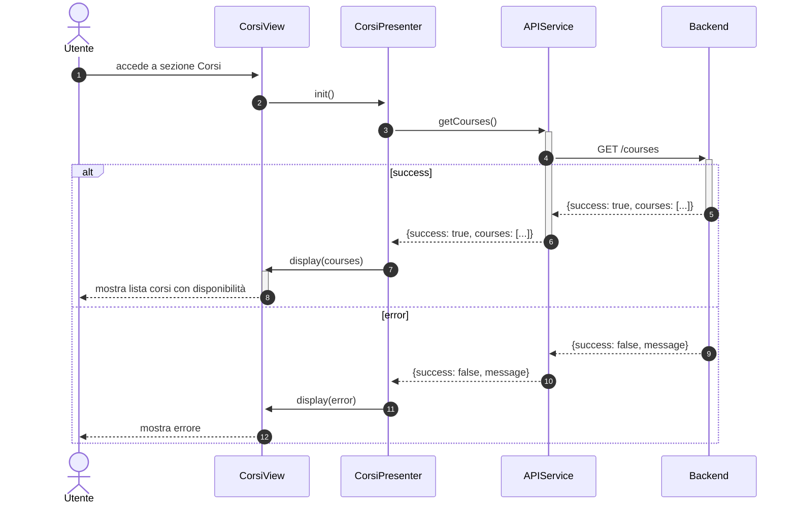
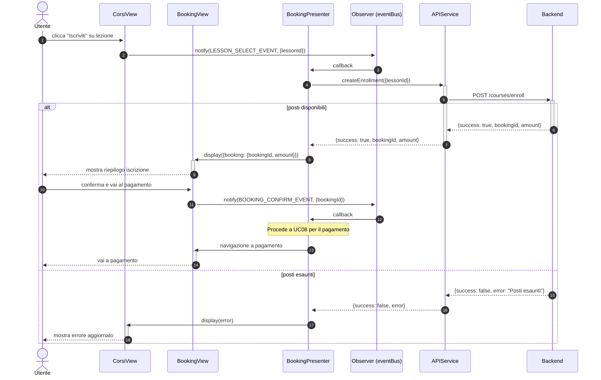

# Modulo Calendario - Frontend

## Casi d'uso Correlati
- **UC03**: Visualizzazione Disponibilità Campi (Selezione data/slot)
- **UC04**: Prenotazione Campo Sportivo
- **UC05**: Visualizzazione Corsi (Visualizzazione disponibilità)
- **UC06**: Iscrizione a una Lezione

Questo modulo gestisce la visualizzazione del calendario, la selezione della data e dell'orario, e il riepilogo della prenotazione.

## Componenti

### CalendarPresenter
Coordinatore principale del modulo calendario.
- Inizializza i componenti `DatePicker`, `SlotPicker`, e `ReservationResumeView`.
- Instanzia e inizializza i rispettivi presenter: `DatePickerPresenter`, `SlotPickerPresenter`, `ReservationResumePresenter`.
- Gestisce la logica di avanzamento settimanale (`DATE_INCREMENT_EVENT`).

### CalendarView
Contenitore layout per i tre sotto-moduli:
- Date Picker (selezione giorno)
- Slot Picker (selezione orario)
- Reservation Resume (riepilogo)

### Sotto-componenti
- **DatePicker / DatePickerPresenter**: Gestisce la visualizzazione dei giorni e la selezione della data.
- **SlotPicker / SlotPickerPresenter**: Gestisce la visualizzazione degli slot orari disponibili per la data selezionata.
- **ReservationResumeView / ReservationResumePresenter**: Mostra i dettagli della prenotazione corrente.

## Diagramma delle Classi

## Diagrammi di Attività

### Visualizzazione Disponibilità (UC03)

### Prenotazione Campo (UC04)

### Visualizzazione Corsi (UC05)

### Iscrizione Lezione (UC06)

## Diagrammi di Sequenza

### Flusso Selezione Slot (Frontend - UC03)

### Flusso Prenotazione (Frontend - UC04)

### Flusso Visualizzazione Corsi (Frontend - UC05)

### Flusso Iscrizione Lezione (Frontend - UC06)

