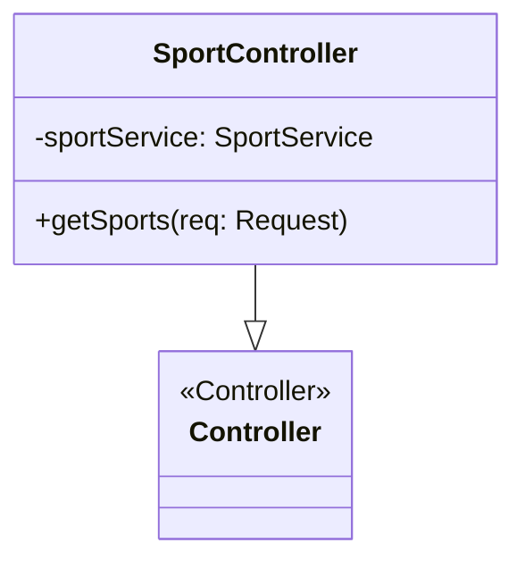
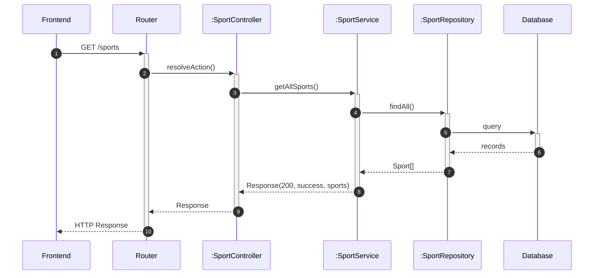

# Modulo Selezione Sport - Backend

## Casi d'uso Correlati
- **UC03**: Visualizzazione Disponibilità Campi (Selezione Sport iniziale)

Questo modulo gestisce il recupero delle informazioni sugli sport disponibili.

## Diagramma delle Classi

### Controller Layer

## Diagrammi di Sequenza

### Flusso Recupero Sport (Backend) (Derived)

