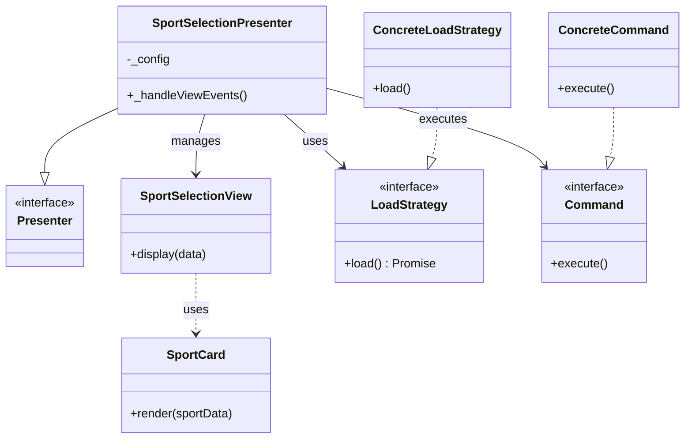
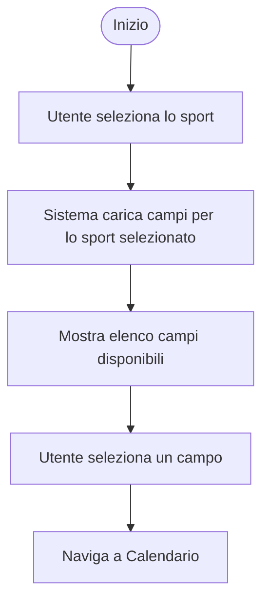
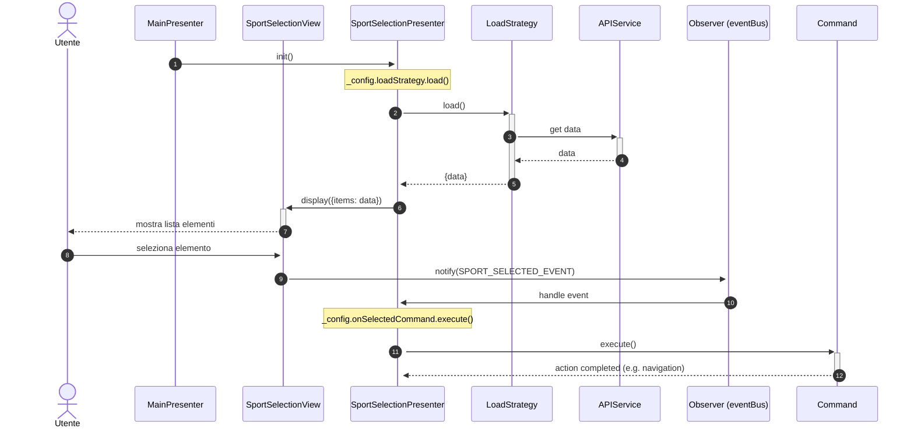

# Modulo Selezione Sport - Frontend

## Casi d'uso Correlati
- **UC03**: Visualizzazione Disponibilità Campi (Selezione Sport iniziale)

Questo modulo gestisce la visualizzazione e la selezione degli sport disponibili.

## Componenti

### SportSelectionPresenter
Gestisce il caricamento degli sport e la selezione.
- Utilizza una `loadStrategy` per caricare i dati (es. da API o statici).
- Sottoscrive a `SPORTS_LOAD_EVENT` per avviare il caricamento.
- Sottoscrive a `SPORT_SELECTED_EVENT` per eseguire un comando (`onSelectedCommand`) quando un utente seleziona uno sport.

### SportSelectionView
Visualizza la griglia o la lista degli sport.
- Riceve i dati dal presenter e li renderizza.
- Emette `SPORT_SELECTED_EVENT`.

### SportCard
Componente UI che rappresenta un singolo sport.

## Diagramma delle Classi

## Diagramma di Attività

## Diagrammi di Sequenza

### Flusso Selezione (con Strategy e Command)

