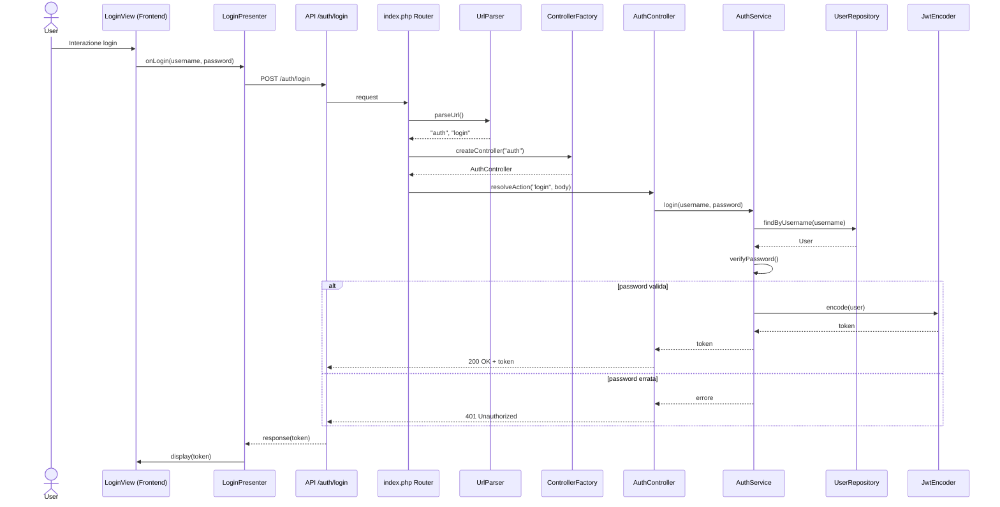

# Class Diagram

Questo diagramma delle classi è stato generato sintetizzando le entità e le interazioni definite nei diagrammi di sequenza in `documentazione/Diagrammi di sequenza.md` (UC01) e `mod.md` (UC02-UC13).

```mermaid
classDiagram
    %% --- Entities / Models ---
    class Utente {
        +Integer id
        +String email
        +String passwordHash
        +String nome
        +String cognome
        +Ruolo ruolo
        +getProfile()
        +updateProfile()
    }

    class Ruolo {
        <<enumeration>>
        CLIENTE
        ADMIN
    }

    class CampoSportivo {
        +Integer id
        +String nome
        +String sport
        +Boolean attivo
        +isAvailable(date, time)
    }

    class Slot {
        +Integer id
        +Integer campoId
        +Date data
        +Time orarioInizio
        +Time orarioFine
        +Boolean occupato
        +Prezzo prezzo
    }

    class Prenotazione {
        +Integer id
        +Integer utenteId
        +Integer slotId
        +Date dataPrenotazione
        +StatoPrenotazione stato
        +cancella()
    }

    class Corso {
        +Integer id
        +String nome
        +String descrizione
        +Boolean attivo
        +getLezioni()
    }

    class Lezione {
        +Integer id
        +Integer corsoId
        +Date data
        +Time orario
        +Integer postiTotali
        +Integer postiDisponibili
        +Prezzo prezzo
        +iscriviUtente(utenteId)
    }

    class Abbonamento {
        +Integer id
        +String nome
        +TipoAbbonamento tipo
        +Prezzo prezzo
        +Integer durataMesi
    }

    class AbbonamentoAttivo {
        +Integer id
        +Integer utenteId
        +Integer abbonamentoId
        +Date dataInizio
        +Date dataScadenza
        +isValid()
    }

    class Pagamento {
        +Integer id
        +Integer utenteId
        +Integer riferimentoId  %% Booking ID or Lesson ID or Sub ID
        +TipoRiferimento tipoRiferimento
        +Decimal importo
        +Date data
        +StatoPagamento stato
        +String transactionToken
    }

    %% --- Services ---
    class AuthService {
        +autenticaUtente(email, password)
        +registraUtente(datiUtente)
        +recuperaPassword(email)
        -generaToken()
    }

    class UserService {
        +getProfile(userId)
        +updateProfile(userId, dati)
    }

    class BookingService {
        +getAvailableSlots(sport, date)
        +createBooking(userId, slotId)
        +cancelBooking(userId, bookingId)
        +checkAvailability(slotId)
    }

    class CourseService {
        +getAllActiveCourses()
        +enrollStudent(userId, lessonId)
        +addLesson(courseId, data)
    }

    class SubscriptionService {
        +buySubscription(userId, planId)
        +checkActiveSubscription(userId)
    }

    class PaymentService {
        +initPayment(orderId, amount)
        +verifyPayment(token)
    }

    class FacilityService {
        +addFacility(dati)
        +deleteFacility(id)
        +updateFacility(id, dati)
    }

    class HistoryService {
        +getUserHistory(userId)
    }

    %% --- Controllers ---
    class AuthController {
        +login(req)
        +register(req)
    }

    class UserController {
        +getMe()
        +updateMe(req)
    }

    class BookingController {
        +getAvailableSlots(req)
        +createBooking(req)
        +cancelBooking(id)
    }

    class CourseController {
        +getCourses()
        +enrollLesson(id)
    }

    class AdminController {
        +manageFacilities()
        +manageCourses()
        +manageTariffs()
    }

    %% --- Relationships ---
    Utente "1" --> "0.*" Prenotazione : effettua
    Utente "1" --> "0..1" AbbonamentoAttivo : possiede
    Utente "1" --> "0.*" Pagamento : esegue

    Prenotazione "1" --> "1" Slot : riserva
    Slot "1" --> "1" CampoSportivo : appartiene_a

    Lezione "1" --> "1" Corso : parte_di
    Utente "0.*" --> "0.*" Lezione : iscritto_a

    AbbonamentoAttivo "1" --> "1" Abbonamento : istanza_di

    %% Service Dependencies
    AuthController --> AuthService
    UserController --> UserService
    BookingController --> BookingService
    CourseController --> CourseService
    AdminController --> FacilityService
    AdminController --> CourseService : uses
    AdminController --> SubscriptionService
    
    BookingService --> PaymentService : uses
    CourseService --> PaymentService : uses
    SubscriptionService --> PaymentService : uses

```







 ``` mermaid 
sequenceDiagram
    autonumber
    
    %% Definizione dei Partecipanti
    actor User as Utente
    box "Frontend" #f9f9f9
        participant View as LoginView
        participant Pres as LoginPresenter
    end
    
    box "Backend Server (Index.php)" #f9f9f9
        participant Router as Router
        participant Ctrl as AuthController
        participant Svc as AuthService
        participant Repo as UserRepository
        participant JWT as JwtEncoder
    end

    %% 1. Interazione Utente
    User->>View: Interagisce (Inserisce credenziali)
    activate View
    
    %% 2. Evento View
    View->>Pres: Emette evento di login
    activate Pres
    
    %% 3. Api Call
    Pres->>Router: HTTP POST /auth/login (username, password)
    activate Router
    
    %% 4. Parsing e Factory (Logica interna Index.php)
    note right of Router: Crea UrlParser e ControllerFactory.<br/>Identifica stringa "auth".
    
    Router->>Ctrl: Genera/Istanzia AuthController
    activate Ctrl
    
    %% 5. Resolve Action
    Router->>Ctrl: resolveAction("login")
    
    %% 6. Chiamata al Service
    Ctrl->>Svc: login(username, password)
    activate Svc
    
    %% 7. Verifica e Token
    Svc->>Repo: findByUsername(username)
    activate Repo
    Repo-->>Svc: Restituisce Utente
    deactivate Repo
    
    Svc->>Svc: Verifica Password
    
    Svc->>JWT: encode(user)
    activate JWT
    JWT-->>Svc: Restituisce Token
    deactivate JWT
    
    %% 8. Risposta
    Svc-->>Ctrl: Restituisce Dati + Token
    deactivate Svc
    
    Ctrl-->>Router: Response 200 OK (Token)
    deactivate Ctrl
    
    Router-->>Pres: JSON Response (Token)
    deactivate Router
    
    %% 9. Aggiornamento UI
    Pres->>View: display(success)
    deactivate Pres
    deactivate View
 ```

 ``` mermaid 
sequenceDiagram
    autonumber
    
    %% Definizione dei Partecipanti chiave
    actor User as Utente
    participant Frontend as Frontend (View/Presenter)
    
    box "Backend Server" #f9f9f9
        participant ApiEntry as API Entry Point
        participant Logic as Auth Service / Controller
        participant Data as Repository
    end

    %% 1. Richiesta di Login
    User->>Frontend: Inserisce Credenziali
    activate Frontend
    
    Frontend->>ApiEntry: Richiesta POST /login (Credenziali)
    activate ApiEntry
    
    %% 2. Gestione e Logica
    ApiEntry->>Logic: Gestisci Richiesta di Login
    activate Logic
    
    Logic->>Data: Recupera Dati Utente (Username)
    activate Data
    Data-->>Logic: Ritorna Utente
    deactivate Data
    
    note right of Logic: Verifica password e Genera Token JWT
    
    %% 3. Risposta
    Logic-->>ApiEntry: Ritorna Token (Successo)
    deactivate Logic
    
    ApiEntry-->>Frontend: HTTP 200 (Token)
    deactivate ApiEntry
    
    %% 4. Aggiornamento UI
    Frontend->>Frontend: Salva Token e Aggiorna Vista
    deactivate Frontend

```