# Analisi Casi d'uso e Diagrammi di Sequenza

Approfondimento dei diagrammi di sequenza per i casi d'uso dal UC02 al UC13, includendo i flussi principali e le varianti alternative (errori, eccezioni).

## UC02 - Gestione Profilo Utente

### Flusso Principale - Visualizzazione e Modifica Profilo

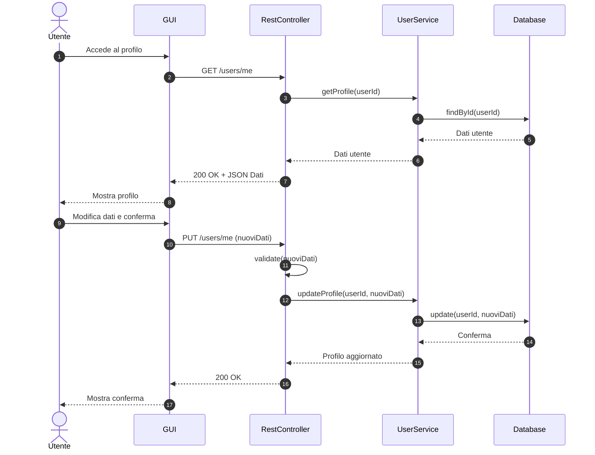

### Flusso Alternativo - Errore Validazione Dati (ERR01)

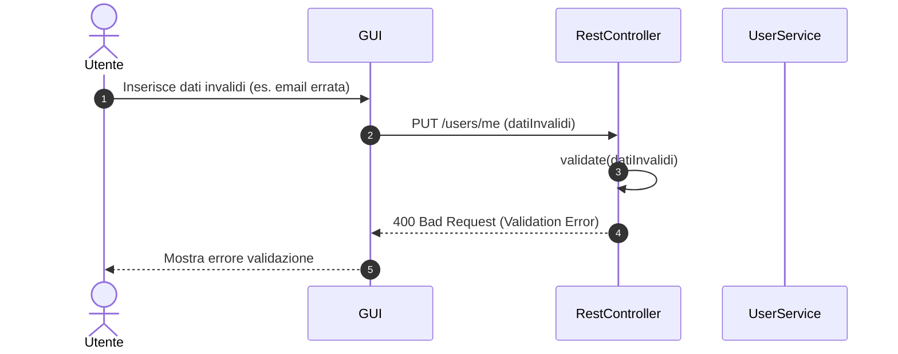

## UC03 - Visualizzazione Disponibilità Campi

### Flusso Principale - Ricerca Slot

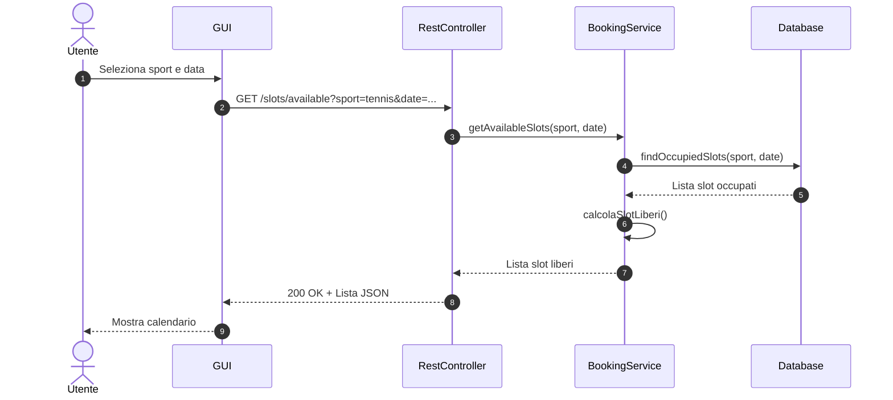

### Flusso Alternativo - Nessuno Slot Disponibile

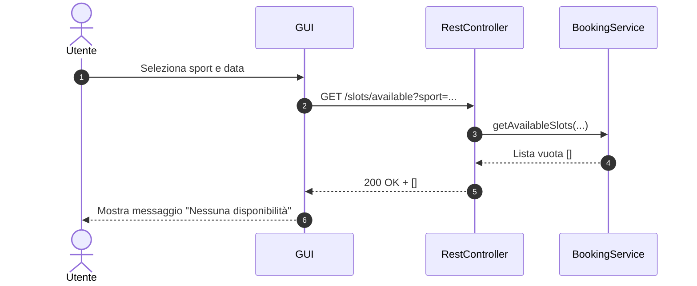

## UC04 - Prenotazione Campo Sportivo

### Flusso Principale - Prenotazione con Successo

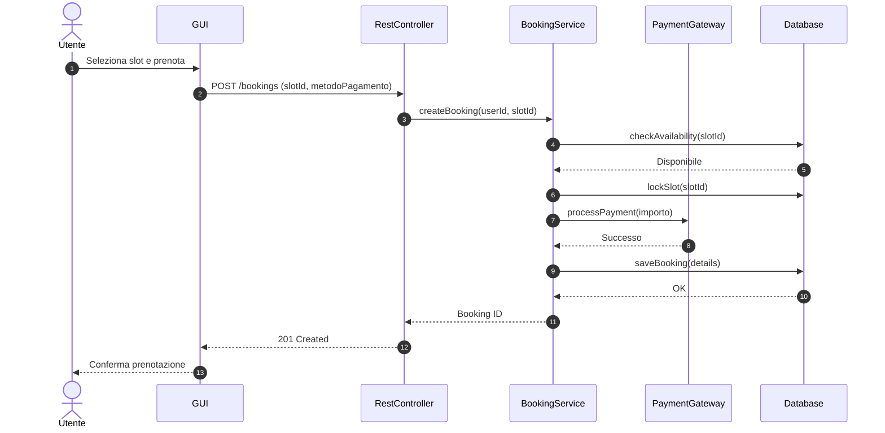

### Flusso Alternativo - Slot Non Più Disponibile (ERR01)

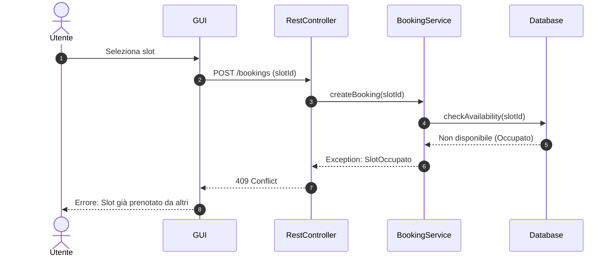

### Flusso Alternativo - Pagamento Fallito (ERR02)

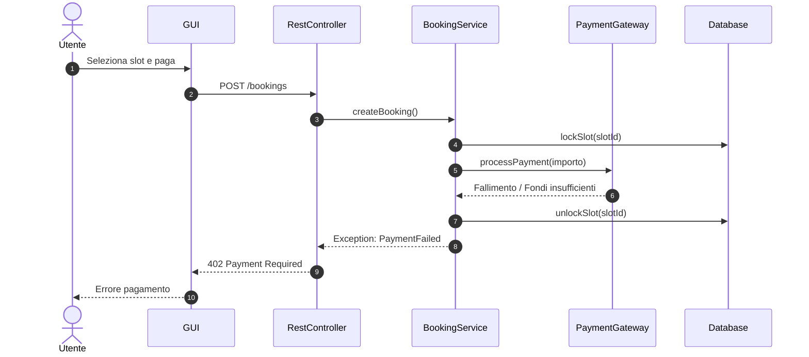

## UC05 - Visualizzazione Corsi

### Flusso Principale - Elenco Corsi

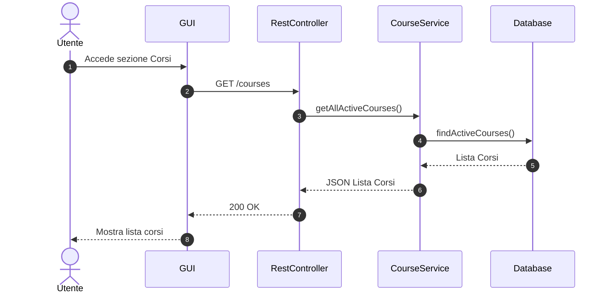

## UC06 - Iscrizione a Lezione di un Corso

### Flusso Principale - Iscrizione con Successo

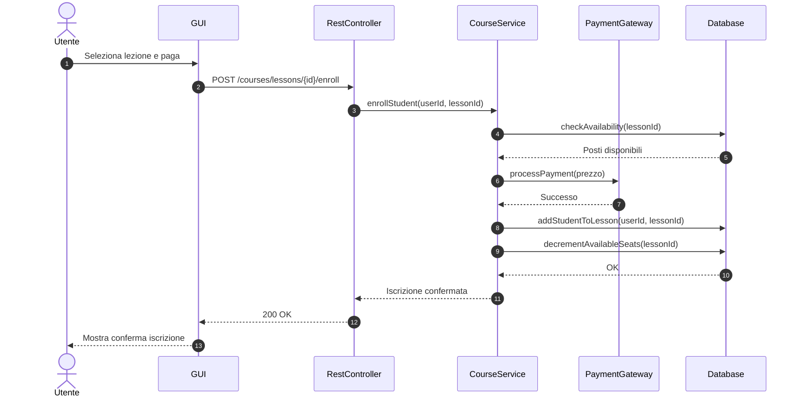

### Flusso Alternativo - Posti Esauriti (ERR01)

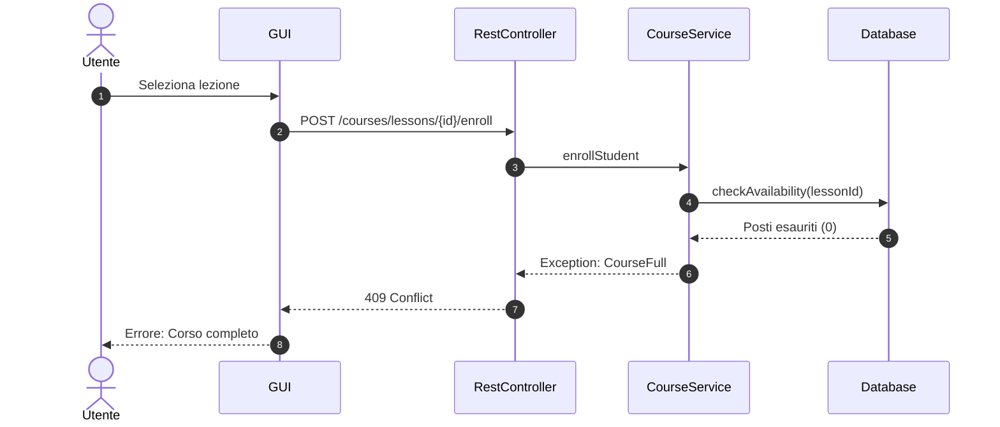

## UC07 - Cancellare Prenotazione

### Flusso Principale - Cancellazione Valida

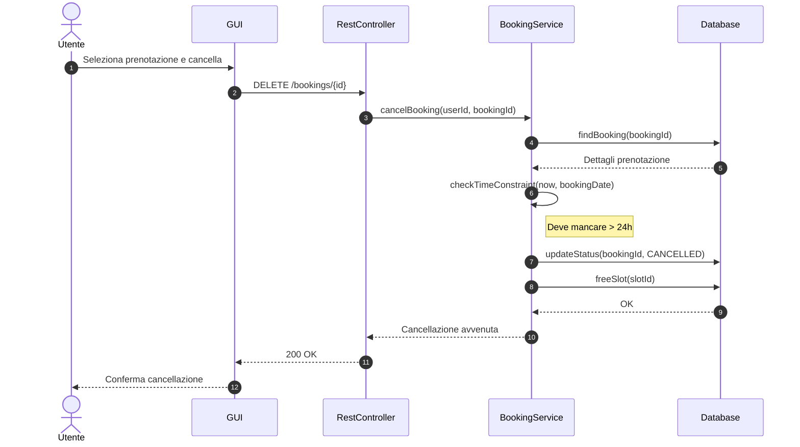

### Flusso Alternativo - Cancellazione Tardiva (ERR01)

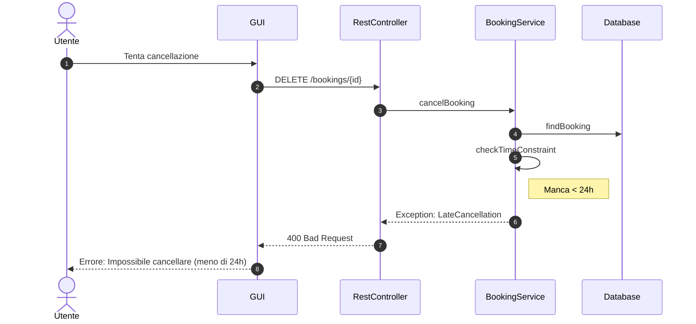

## UC08 - Effettuare Pagamento Singolo

### Flusso Principale - Pagamento Diretto

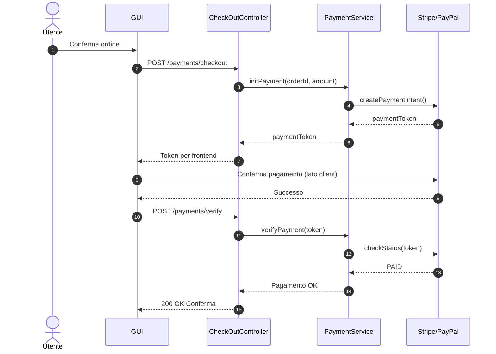

### Flusso Alternativo - Errore Fondi (ERR01)

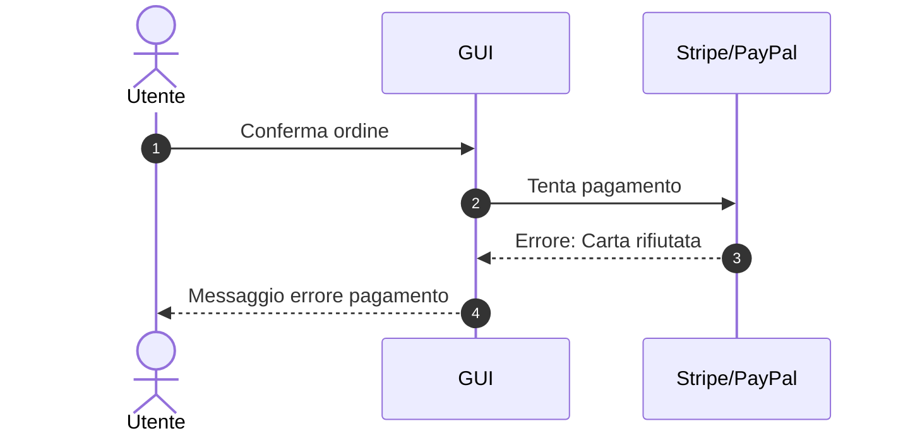

## UC09 - Acquistare Abbonamento

### Flusso Principale - Acquisto Nuovo Abbonamento

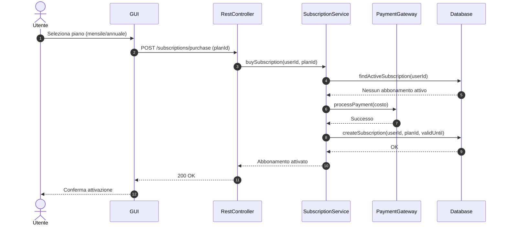

### Flusso Alternativo - Abbonamento Già Attivo (ERR01)

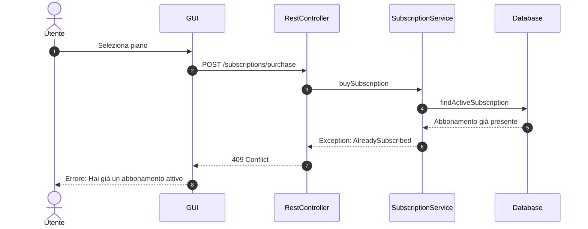

## UC10 - Visualizzare Storico Prenotazioni e Pagamenti

### Flusso Principale - Consultazione Storico

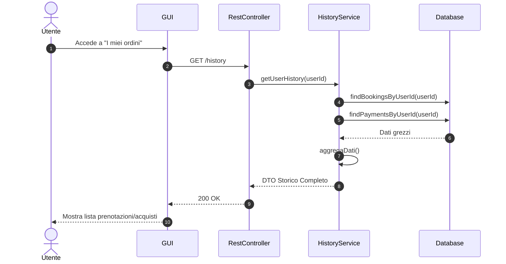

## UC11 - Gestire Campi Sportivi (Admin)

### Flusso Principale - Creazione Campo

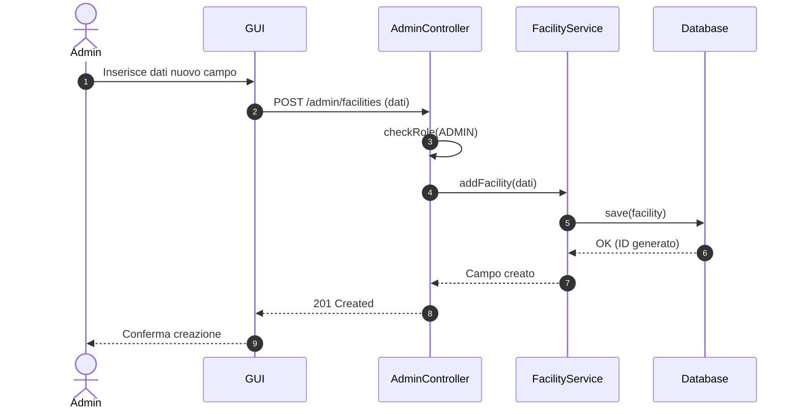

### Flusso Alternativo - Eliminazione Campo Occupato (ERR01)

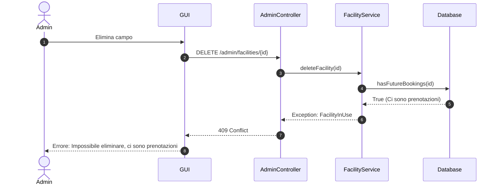

## UC12 - Gestire Corsi e Lezioni (Admin)

### Flusso Principale - Aggiunta Lezione a Corso

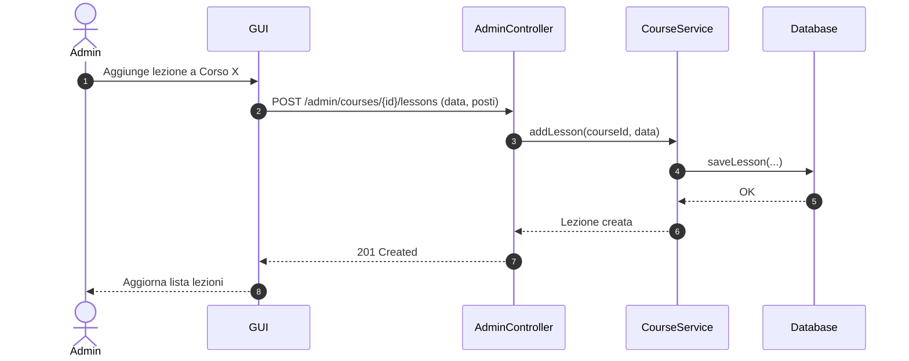

## UC13 - Gestire Tariffe e Abbonamenti (Admin)

### Flusso Principale - Aggiornamento Prezzo

```mermaid
sequenceDiagram
    autonumber
    actor Admin
    participant GUI as GUI
    participant API as AdminController
    participant Service as PricingService
    participant DB as Database

    Admin ->> GUI: Modifica prezzo orario Tennis
    GUI ->> API: PATCH /admin/tariffs/tennis (newPrice)
    API ->> Service: updateTariff("tennis", newPrice)
    Service ->> DB: updatePrice(...)
    DB -->> Service: OK
    Service -->> API: Prezzo aggiornato
    API -->> GUI: 200 OK
    GUI -->> Admin: Conferma modifica
```
