# Diagrammi di Sequenza

## UC01 - Registrazione / Autenticazione

### Flusso principale - Autenticazione

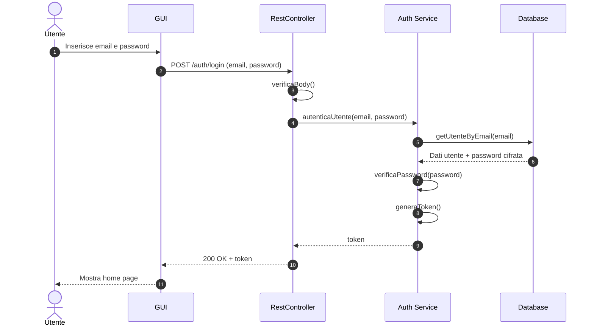

### Flusso secondario - Registrazione

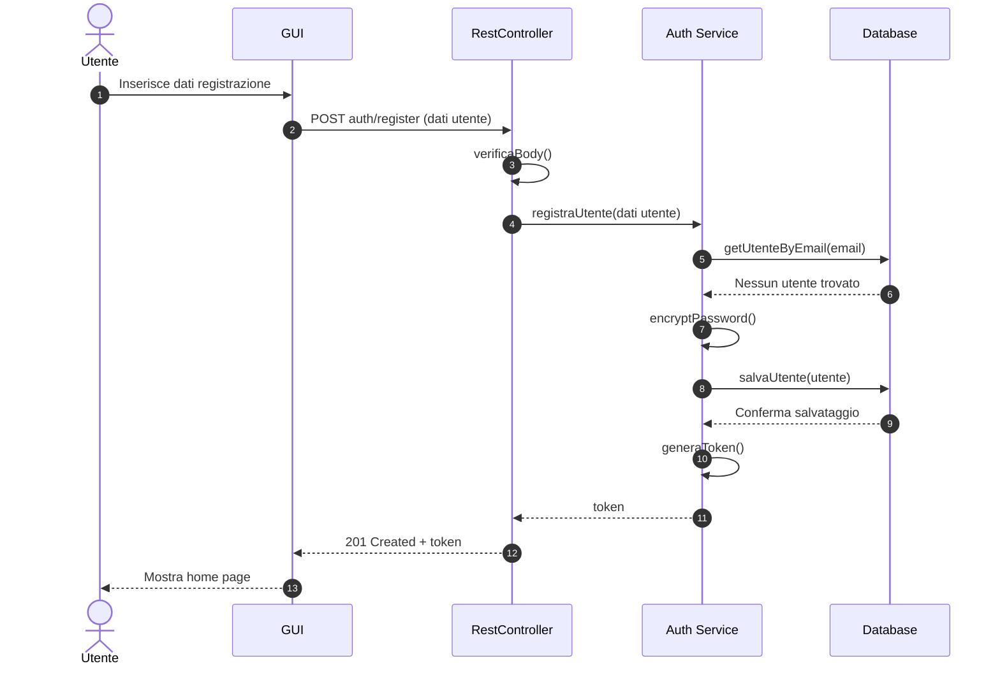

## UC02 - Visualizzare e gestire profilo utente

### Flusso principale - Visualizzazione e Modifica Profilo

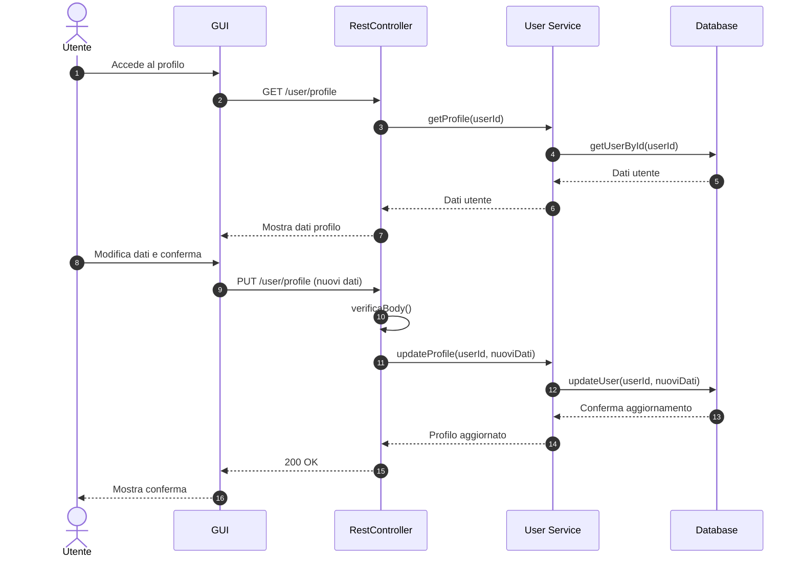

## UC03 - Visualizzare disponibilità campi

### Flusso principale - Ricerca Disponibilità

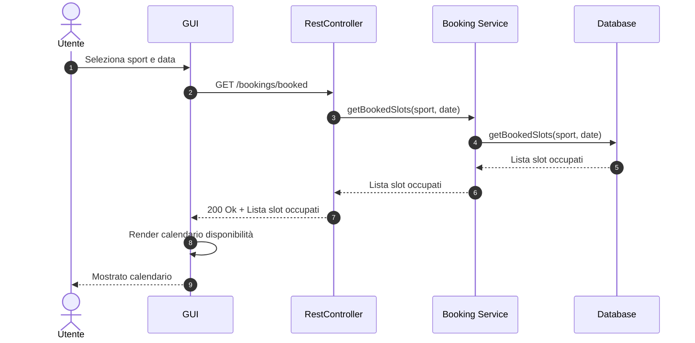

## UC04 - Prenotare campo sportivo

### Flusso principale - Prenotazione con Pagamento

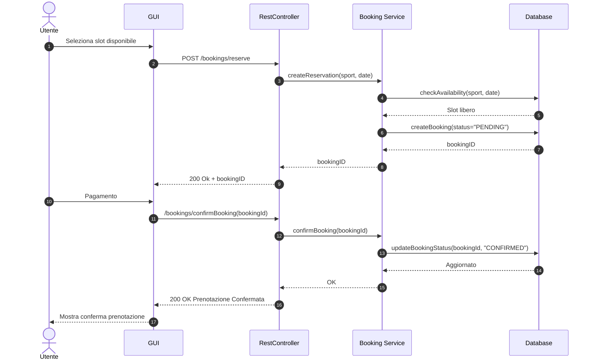

## UC05 - Visualizzare corsi

### Flusso principale - Elenco Corsi

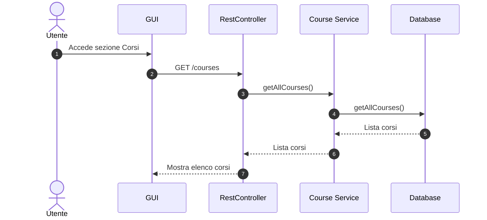

## UC06 - Iscriversi a una lezione di un corso

### Flusso principale - Iscrizione Lezione

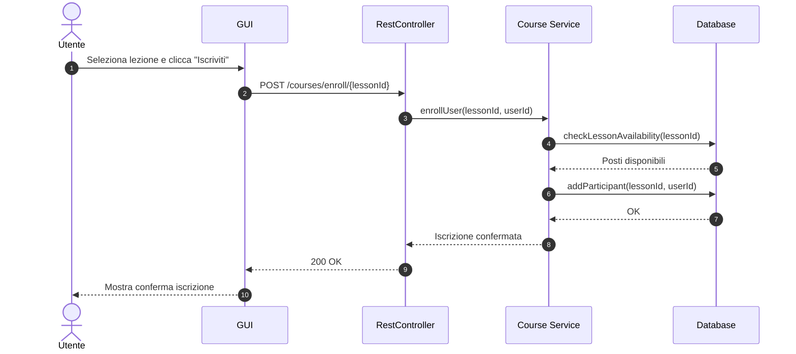

## UC07 - Cancellare prenotazione

### Flusso principale - Cancellazione valida

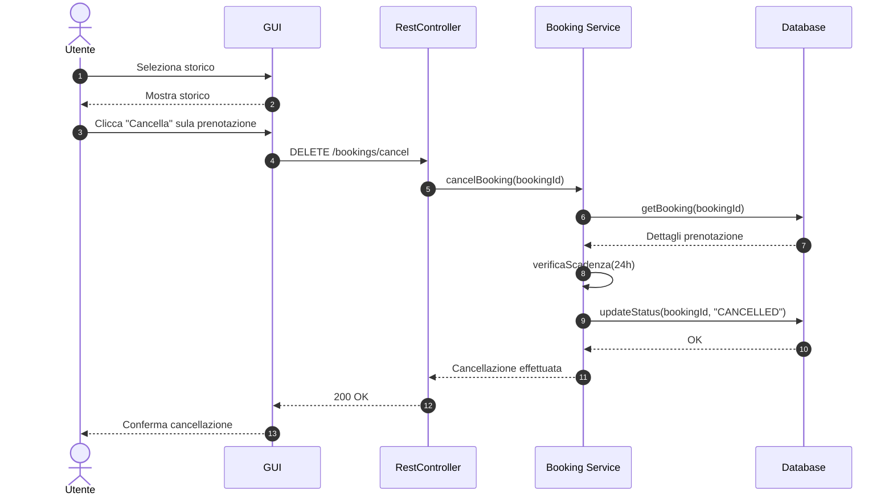

## UC08 - Effettuare pagamento singolo

### Flusso principale - Processo di Pagamento

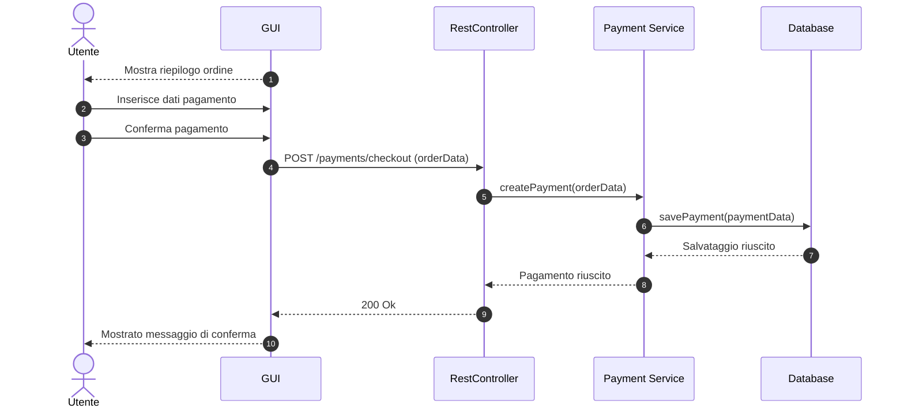

## UC09 - Acquistare abbonamento

### Flusso principale - Acquisto Abbonamento

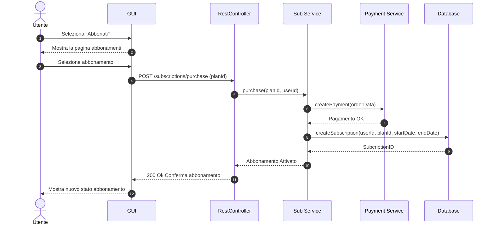

## UC10 - Visualizzare storico prenotazioni e pagamenti

### Flusso principale - Visualizzazione Storico

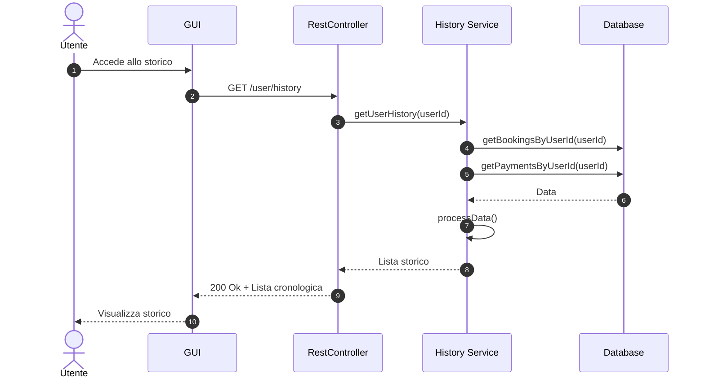

## UC11 - Gestire campi sportivi (Admin)

### Flusso principale - Creazione Campo

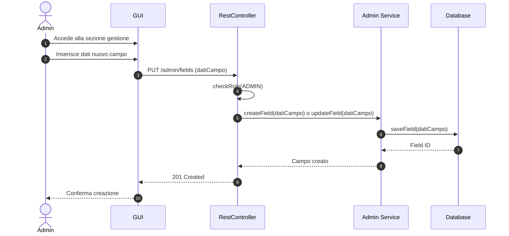

## UC12 - Gestire corsi e lezioni (Admin)

### Flusso principale - Aggiunta Lezione

```mermaid

```

## UC13 - Gestire tariffe e abbonamenti (Admin)

### Flusso principale - Aggiornamento Tariffa

```mermaid
sequenceDiagram
    autonumber
    actor Admin
    participant GUI as AdminPanel
    participant API as RestController
    participant TariffService as Tariff Service
    participant DB as Database

    Admin ->> AdminPanel: Modifica prezzo tariffa
    AdminPanel ->> API: PUT /admin/tariffs/{tariffId} (newPrice)
    API ->> API: checkRole(ADMIN)
    API ->> TariffService: updateTariff(tariffId, newPrice)
    TariffService ->> DB: updatePrice(tariffId, newPrice)
    DB -->> TariffService: OK
    TariffService -->> API: Tariffa aggiornata
    API -->> AdminPanel: 200 OK
    AdminPanel -->> Admin: Conferma modifica
```
