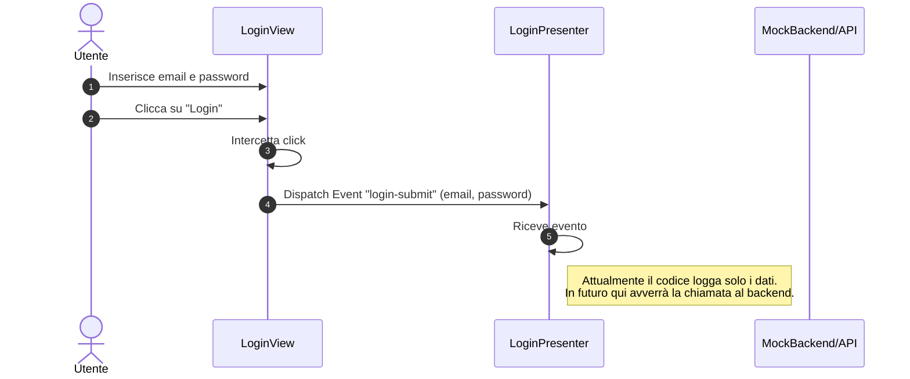
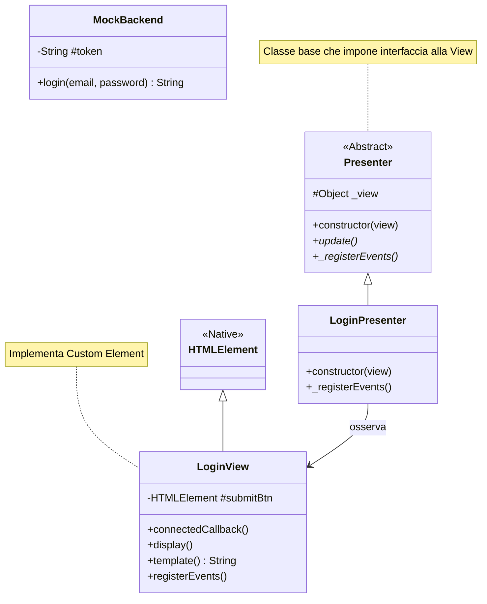

# Modifiche ai Diagrammi

In base all'analisi del codice presente nella cartella `implementazione/frontend`, ecco le proposte di modifica ai diagrammi.

## Modifiche ai Diagrammi di Sequenza

Il codice implementa un pattern **Model-View-Presenter (MVP)** per il frontend, separando la logica di visualizzazione (`LoginView`) dalla logica di gestione eventi (`LoginPresenter`). I diagrammi di sequenza dovrebbero riflettere questa separazione invece di mostrare un generico attore `GUI`.

### UC01 - Autenticazione (Frontend Flow)

## Diagrammi di Classe per il Frontend

Di seguito il diagramma delle classi basato su `app.js`.

### Class Diagram - Authentication Module

